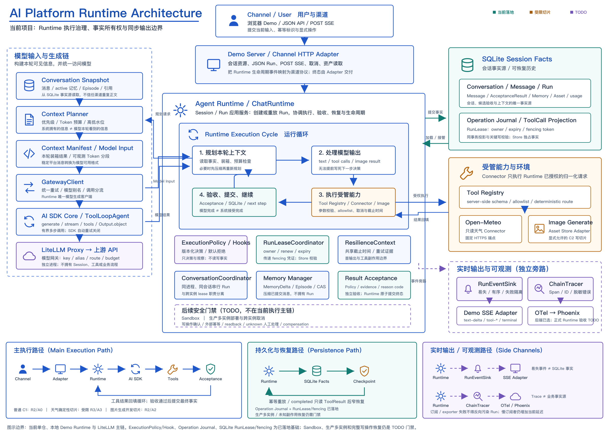

# AI 应用基础平台

面向不同业务场景，按需组合渠道、Agent Runtime、连接器与知识、模型网关以及治理能力的 AI 应用基础平台。

当前仓库以 **V0.6 会话与上下文基线**为主体，并建设 **V1 首个只读工具与执行治理切片**：提供浏览器多会话 Demo、SQLite 会话事实源、结构化记忆、Context Planner、统一模型调用、天气工具、受限恢复、结果验收、智能 operation 路由和图片生成/编辑开发能力。当前形态用于本地开发、确定性回归和方案验证，不代表生产级平台控制面或通用持久工作流已经完成。

## 项目定位

“AI 应用基础平台”是项目总称，项目、仓库和目录统一使用 `ai-platform`。系统按六个架构区域组织：

| 区域 | 核心职责 | 当前状态 |
| --- | --- | --- |
| 渠道与体验层 | Web、IM、IDE、API Adapter 的输入输出适配 | 已有 React 浏览器 Demo 和 Demo Server HTTP Adapter |
| 平台控制面 | 租户、应用、Agent 定义、版本发布和策略配置 | 尚未实现 |
| Agent Runtime | Session/Run、上下文、operation 路由、工具循环、结果组装与验收 | 已有本地集成切片 |
| 连接器与知识层 | Tool Registry、MCP、业务 API、搜索、文档与 RAG | 已有 Open-Meteo 只读天气 Connector；其他能力尚未实现 |
| 模型网关 | 模型访问、别名、provider key、路由、预算和限流 | 已有独立 LiteLLM Proxy；单应用 virtual key/预算治理为隔离 PoC |
| 治理与可观测 | 身份上下文、执行策略、审计、Trace、评测和反馈 | 已有本地执行治理、回归评测和默认关闭的 OTel 旁路 |

严格意义上的 **AI Gateway** 只指模型网关区域；未来拆出的服务使用 `model-gateway`。页面、会话、工具循环、RAG 和业务流程不属于模型网关，也不得绕过 Agent Runtime 形成新的业务模型入口。



完整的区域职责、数据所有权、服务拆分条件和演进路线见[架构说明](./docs/ai-structure.md)。

## 当前业务主链

所有业务模型请求统一经过 Agent Runtime：

```text
浏览器 Demo / 未来渠道
  -> Demo Server 渠道 HTTP Adapter
  -> Agent Runtime
  -> GatewayClient
  -> AI SDK Core / Responses 图片编辑 Adapter
  -> LiteLLM Proxy
  -> 上游 OpenAI-compatible API
```

浏览器只提交当前输入、稳定引用和幂等标识，不接触 LiteLLM key 或上游真实 key。GatewayClient、AI SDK 和 Responses Adapter 都是 Runtime 的下游实现，不是并列业务入口。

`scripts/test-chat.sh -> LiteLLM Proxy -> 上游模型` 只用于本地 smoke test、CI 和排障，不属于平台业务主链或普通客户端接入方式。

## 当前能力与边界

执行可靠性使用 R0-R4，结果可信度使用 A0-A4。两个等级相互独立，详细定义见[运行可靠性与结果验收](./docs/runtime-reliability-and-acceptance.md)。

| 场景 | 当前能力 | 等级 | 主要边界 |
| --- | --- | --- | --- |
| C1 普通对话 | 持久化 Conversation/Run/Message、幂等重放、统一重试、流式输出、取消和恢复入口 | R2 / A0 | 自然语言事实正确性没有独立验收 |
| 只读天气工具 | 确定性开放 `get_weather`、持久化 ToolResult、重启后受限总结恢复、天气 AcceptanceResult | 受限 R3 / A3 | 只覆盖已注册、已完成的只读天气 ToolResult 稳定点 |
| C2 图片生成/编辑 | 文生图、受控单图上传、多轮 A→B→C 编辑、资产来源链、结果格式校验和幂等重放 | R2 / A2 | 仍是开发切片，尚无内容安全、正式对象存储和完整质量/成本基线 |

执行治理已经落地版本化 `ExecutionPolicy`、独立 `Operation journal` 和 SQLite `RunLease`/`fencing`：未知操作默认拒绝，已知副作用默认要求确认，过期 lease 可由更大的 fencing token 接管，旧 owner 的关键提交会被拒绝。这些能力只构成 R4 的协调基础，不等于通用持久工作流或生产级多实例协调；共享生产数据库、跨实例取消、业务回读、补偿和生产级协调演练尚未完成。

同步输出遵守三层边界：

- Agent Runtime 只向进程内 `RunEventSink` 发布易失、有序、不可变的生命周期事件。
- Demo Server 把事件映射为既有 POST SSE，并在 Runtime 返回后交付完整终态。
- SQLite `conversation_events` 只保存事务内已提交事实，用于游标同步和恢复。

`RunEventSink` 不是 Broker、Outbox、Trace 或事实源，不能直接挂接无界或远程慢订阅者。

当前明确未完成：

- 正式平台控制面、多租户身份和正式多渠道接入。
- MCP、企业业务 Connector、私有文档解析、RAG、知识权限和完整 C4 业务数据能力。
- 生产级多实例部署、跨实例取消、长任务 Worker 和运行中工具 checkpoint。
- Sandbox、有副作用写操作的确认/回读/补偿，以及 exactly-once 证明。
- 正式 Runtime Trace 验收、在线评测反馈闭环、完整图片理解资产输入、内容审核和生产资产治理。

## 快速开始

### 1. 环境要求

- Node.js `22.5.0` 或更高版本，用于内置 `node:sqlite`。
- Docker 与 Docker Compose，用于启动 LiteLLM Proxy。

### 2. 安装与配置

```bash
npm ci
cp .env.example .env
```

至少在 `.env` 中替换以下本地示例值：

```bash
UPSTREAM_API_BASE=https://你的中转站地址/v1
UPSTREAM_API_KEY1=你的对话与图片编辑模型真实-key
UPSTREAM_API_KEY2=你的图片生成模型真实-key
LITELLM_MASTER_KEY=你的本地模型网关管理-key

LITELLM_MODEL=gpt-5.6
LITELLM_IMAGE_MODEL=gpt-image-2
LITELLM_IMAGE_EDIT_MODEL=gpt-5.6
LITELLM_CHAT_MODELS=gpt-5.6
LITELLM_VISION_MODELS=gpt-5.6
LITELLM_IMAGE_EDITING_MODELS=gpt-5.6
```

不要提交 `.env`。真实上游地址、模型名和 key 只保留在模型网关与服务端配置中。

默认 [`config.yaml`](./config.yaml) 使用以下平台别名：

| 平台别名 | 上游模型 | 用途 |
| --- | --- | --- |
| `gpt-5.6` | `openai/gpt-5.6-sol` | 对话、视觉输入和 Responses 图片编辑 |
| `gpt-image-2` | `openai/gpt-image-2` | 图片生成 |

如果中转站使用不同模型名，需要同步修改 `config.yaml` 的映射和 `.env` 中的 Runtime 默认别名。承载图片副作用的模型映射保持 `num_retries: 0`，由 Runtime 统一控制尝试预算。

### 3. 启动模型网关

```bash
docker compose up -d
```

LiteLLM 默认监听 `http://localhost:4000`。需要排查启动状态时再查看日志：

```bash
docker compose logs -f litellm
```

退出日志跟随不会停止容器。

### 4. 启动 Demo

```bash
npm run demo
```

浏览器访问 `http://localhost:4010`。会话数据库和图片二进制默认分别保存在 `.data/ai-platform.sqlite` 与 `.data/image-assets/`。

开发渠道页面时，可以在两个终端分别运行：

```bash
npm run demo:server
npm run demo:ui
```

此时通过 `http://localhost:5173` 访问 Vite 开发页面，`/api` 会代理到 `http://localhost:4010`。

## Demo 使用说明

Demo 当前提供以下可直接验证的交互：

- 多会话创建、搜索、重命名、归档、关闭和多标签页事实同步。
- 普通输入统一提交 `operation=auto`；Runtime 根据当前附件和有界会话 routing snapshot 决定对话、图片生成或图片编辑。
- 文本、本地受控图片、远程图片 URL、文档链接和会话消息引用；文档链接只作为文本上下文，不代表平台已经实现文档抓取或解析。
- 最多 5 MiB 的 PNG、JPEG、WebP 源图上传；图片编辑每轮创建新资产，不覆盖历史版本。
- POST SSE 文本增量、工具阶段和图片产物交付，以及显式停止、失败重试、重新生成和中断后继续。
- SQLite 完整消息、结构化记忆、Context Manifest 和 token 高低水位压缩。
- 明确地点的今明日天气查询；Runtime 只在确定性命中时开放 `get_weather`。

普通 Composer 不选择模型别名。Runtime 会按解析后的真实 operation 选择服务端默认模型，并独立校验网关可见性与能力集合。模型目录可见不等于上游账号健康或该模型兼容当前操作。

## Runtime API

Demo Server 当前提供分层的本地 API：

| API | 说明 |
| --- | --- |
| `GET /api/gateway/status` | 返回 LiteLLM 可达性、可见别名、默认模型和静态能力集合 |
| `GET /api/runtime/conversations` | 列出会话 |
| `POST /api/runtime/conversations` | 创建会话 |
| `GET /api/runtime/conversations/{id}` | 查询消息、记忆、版本和最新 Run |
| `PATCH /api/runtime/conversations/{id}` | 更新标题或归档状态 |
| `POST /api/runtime/conversations/{id}/image-assets` | 上传当前会话拥有的受控源图 |
| `POST /api/runtime/conversations/{id}/runs` | 创建 JSON Run；普通新请求使用 `operation=auto` |
| `POST /api/runtime/conversations/{id}/runs/stream` | 创建 POST SSE Run |
| `POST /api/runtime/conversations/{id}/run-requests/{requestId}/cancel` | 在 Run 创建前取消排队或结构化分类 |
| `POST /api/runtime/conversations/{id}/runs/{runId}/cancel` | 取消已创建的 Run |
| `GET /api/runtime/conversations/{id}/image-assets/{assetId}/content` | 读取当前会话有权访问的图片资产 |
| `GET /api/runtime/conversations/{id}/events` | 按 SQLite 事件游标订阅已提交事实 |
| `POST /api/runtime/conversations/{id}/close` | 最终 checkpoint 并关闭会话 |

普通新 Run 的最小请求示例：

```json
{
  "operation": "auto",
  "requestId": "request-uuid",
  "clientMessageId": "message-uuid",
  "message": "查询上海明天的天气",
  "imageUrls": [],
  "documentUrls": [],
  "references": []
}
```

渠道不应在普通请求中传入模型别名。`retry`、`regenerate`、`continue` 等恢复动作需要使用新的幂等标识，并通过 `sourceRunId` 与 `recoveryMode` 引用来源 Run；完整契约以 [OpenSpec](./openspec/specs/ai-platform/spec.md) 为准。

## 模型连通性诊断

下面的脚本只验证 LiteLLM、模型映射和上游连通性，不验证 Agent Runtime、会话、工具或结果验收：

```bash
set -a
source .env
set +a
BASE_URL="$LITELLM_BASE_URL" bash scripts/test-chat.sh
```

业务客户端不得把该脚本或 LiteLLM `/v1/chat/completions` 当作平台业务入口。

## 验证

运行完整确定性回归：

```bash
npm test
```

常用聚焦入口：

| 命令 | 验证范围 |
| --- | --- |
| `npm run demo:check` | Demo 构建与 gzip 预算 |
| `npm run test:architecture` | 全局架构和业务主链边界 |
| `npm run test:runtime` | Session/Run、上下文、路由、恢复和事件 |
| `npm run test:gateway` | GatewayClient 与 AI SDK/Responses 协议 |
| `npm run test:tools` | 天气工具与 Connector |
| `npm run test:images` | 图片生成、编辑、资产与错误边界 |
| `npm run test:acceptance` | AcceptanceResult 策略 |
| `npm run test:governance` | ExecutionPolicy、Operation journal、RunLease/fencing |
| `npm run test:scenarios` | 两个真实 Node 进程的故障与重启场景 |
| `npm run eval:runtime-scenarios:deterministic` | 只读工具恢复的确定性场景评测 |
| `npm run eval:runtime-routing:deterministic` | 智能 operation 路由的确定性场景评测 |

真实模型评测必须显式固定平台模型别名，并会调用上游模型：

```bash
npm run eval:runtime-scenarios:real -- --model <fixed-model-alias>
npm run eval:runtime-routing:real -- --model <fixed-model-alias>
```

真实有效样本少于 30 时只标记为 `observation-only`，不能作为发布准确率或质量基线。

修改稳定契约后还应运行：

```bash
openspec validate --specs --strict
```

## 配置与安全边界

完整示例和默认值见 [`.env.example`](./.env.example)，核心配置分组如下：

| 配置 | 作用与边界 |
| --- | --- |
| `UPSTREAM_API_BASE`、`UPSTREAM_API_KEY1/2` | 只供 LiteLLM 访问上游，不进入浏览器或 Run 请求 |
| `LITELLM_MASTER_KEY` | LiteLLM 管理和本地诊断凭据，不提供给普通客户端 |
| `LITELLM_RUNTIME_KEY` | 可选的受限 Runtime virtual key；未配置时仅为本地兼容回退 master key |
| `LITELLM_BASE_URL` | Runtime 使用的 LiteLLM 根地址，默认 `http://localhost:4000`，不要追加 `/v1` |
| `LITELLM_MODEL`、`LITELLM_IMAGE_MODEL`、`LITELLM_IMAGE_EDIT_MODEL` | 三类 operation 的服务端默认平台别名 |
| `LITELLM_*_MODELS` | 服务端静态能力 allowlist；不能仅凭 `/v1/models` 推断操作兼容性 |
| `DEMO_DATABASE_PATH`、`DEMO_IMAGE_ASSET_DIR` | SQLite 事实源与本地图片二进制目录 |
| `DEMO_CONTEXT_*` | Context Planner 预算和 75%/45%/90% 高低硬水位 |
| `DEMO_RUN_TIMEOUT_MS`、`DEMO_MODEL_MAX_ATTEMPTS` | 单个 Run 的共享截止时间和模型总尝试次数 |
| `DEMO_TOOL_MAX_STEPS`、`DEMO_WEATHER_*` | 有界工具循环与固定 Open-Meteo Connector 配置 |
| `OTEL_*` | 默认关闭的 C1 ChainTrace 旁路；启用不改变 Run 事实语义 |

所有密钥只放在服务端 `.env`。日志、Trace、SQLite 公开投影和浏览器响应都不得包含上游 key、图片二进制、物理存储路径或 provider 原始错误正文。

## 文档导航

| 文档 | 内容 |
| --- | --- |
| [项目文档索引](./docs/README.md) | 全部架构、场景、决策和学习资料入口 |
| [架构说明](./docs/ai-structure.md) | 六个区域、依赖规则、数据所有权、服务拆分和路线图 |
| [场景交互链路](./docs/scenario-interaction-chains.md) | C1-C7 场景边界、共同底座、质量维度和建设顺序 |
| [运行可靠性与结果验收](./docs/runtime-reliability-and-acceptance.md) | R0-R4、A0-A4、当前场景等级和扩展模板 |
| [AI SDK Core 对齐](./docs/ai-sdk-core-alignment.md) | 当前采用、适配、延后和不采用的 SDK 能力 |
| [方案选型与复用治理](./docs/solution-selection-governance.md) | 采用/适配/自研门禁、完成定义和存量审计 |
| [方案决策索引](./docs/decisions/README.md) | 候选比较、选择依据、失败证据、退出路径和重评条件 |
| [ChainTrace 运维说明](./docs/c1-chaintrace-operations.md) | 默认关闭的 Phoenix 后端启用、认证、验证和运维边界 |
| [稳定 OpenSpec](./openspec/specs/ai-platform/spec.md) | Session/Run API、鉴权、模型别名、上下文与安全契约 |

README 只说明已可用能力、启动方式和验证入口；候选方案、历史 PoC 过程和详细重评条件以 `docs/decisions/` 与专题文档为准。
