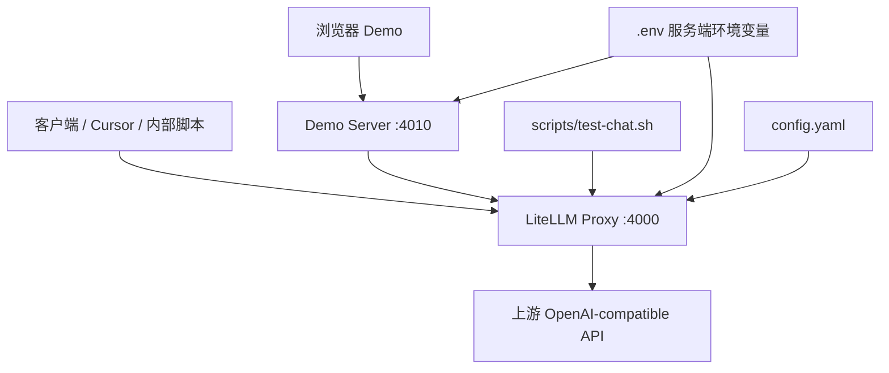

# AI 结构说明

## 当前定位

当前项目是一个轻量 AI Gateway 试用版，核心目标是把上游中转站的真实 key 留在服务端，通过 LiteLLM Proxy 对外暴露统一的 OpenAI-compatible 接口。

它适合当前阶段的小范围内部验证：

- 统一客户端访问入口。
- 隐藏上游真实 `UPSTREAM_API_KEY`。
- 用 `chat-default` 这样的模型别名屏蔽真实模型名。
- 先用本地配置运行，后续需要多人 key、额度、限流和统计时再接数据库。

## 分层结构



## 入口与职责

| 层级 | 文件 | 职责 |
| --- | --- | --- |
| 使用说明 | `README.md` | 启动、测试、客户端配置、后续升级方向 |
| 协作入口 | `AGENTS.md` | AI 协作规则、文档路由、OpenSpec 同步判断 |
| 稳定契约 | `openspec/specs/ai-gateway/spec.md` | 固化代理、鉴权、模型别名、Demo API 和上下文预算能力 |
| Proxy 配置 | `config.yaml` | `chat-default` 到真实上游模型的映射、上游 base/key、master key |
| 容器启动 | `docker-compose.yml` | 启动 LiteLLM Proxy，挂载 `config.yaml`，读取 `.env` |
| Smoke test | `scripts/test-chat.sh` | 用 `LITELLM_MASTER_KEY` 调本地 `/v1/chat/completions` |
| Demo Server | `scripts/demo-server.mjs` | 服务静态页面，提供 `/api/status`、`/api/chat`、`/api/summarize` |
| Demo UI | `demo/index.html` | 浏览器聊天界面，支持文本、图片、文档链接和本地上下文 |

## 调用链路

### 客户端直连 LiteLLM

```text
客户端
  -> http://localhost:4000/v1/chat/completions
  -> Authorization: Bearer LITELLM_MASTER_KEY
  -> model: chat-default
  -> LiteLLM 读取 config.yaml
  -> 命中真实模型 openai/gpt-5.5
  -> 使用 UPSTREAM_API_BASE + UPSTREAM_API_KEY 调用上游
  -> 返回 OpenAI-compatible 响应
```

### 浏览器 Demo 链路

```text
浏览器 Demo
  -> POST /api/chat
  -> Demo Server 组装 messages、图片 URL、文档链接文本、摘要和最近历史
  -> Demo Server 使用 LITELLM_MASTER_KEY 调 LiteLLM
  -> LiteLLM 转发到上游
  -> Demo Server 抽取 choices[0].message.content 返回浏览器
```

浏览器不会接触 `UPSTREAM_API_KEY`，也不直接调用上游中转站。

## 配置边界

| 变量或配置 | 所在位置 | 说明 |
| --- | --- | --- |
| `UPSTREAM_API_BASE` | `.env` | 上游 OpenAI-compatible 地址，通常带 `/v1` |
| `UPSTREAM_API_KEY` | `.env` | 上游真实 key，只能服务端使用 |
| `LITELLM_MASTER_KEY` | `.env` | 本地 LiteLLM 对外访问 key |
| `LITELLM_BASE_URL` | `.env` 可选 | Demo Server 调用 LiteLLM 的地址，默认 `http://localhost:4000` |
| `LITELLM_MODEL` | `.env` 可选 | Demo Server 使用的模型别名，默认 `chat-default` |
| `DEMO_MAX_CONTEXT_TOKENS` | `.env` 可选 | Demo 上下文预算，默认 `12000` |
| `model_list[].model_name` | `config.yaml` | 对外模型别名，目前是 `chat-default` |
| `model_list[].litellm_params.model` | `config.yaml` | 上游真实模型名，目前是 `openai/gpt-5.5` |

## 当前 AI 能力边界

已具备：

- OpenAI-compatible chat completions 代理。
- 服务端密钥收口。
- 单模型别名路由。
- 本地 smoke test。
- 本地浏览器 Demo。
- 图片 URL / 图片 data URL 转发。
- 文档链接作为文本上下文附加。
- 最近对话上下文、摘要记忆和估算 token 预算裁剪。

暂未覆盖：

- 多用户 virtual key 管理。
- 团队、用户、模型维度预算。
- RPM/TPM 限流策略。
- 细粒度调用统计和审计。
- 多上游 fallback。
- 后台管理页面。
- 私有文档抓取、网页解析或文档内图片提取。

## 后续演进顺序

1. 继续保持当前最小代理：只做本地验证和小范围内部使用。
2. 当多人使用时，引入 LiteLLM virtual key 和数据库。
3. 当需要治理时，增加预算、限流、审计和模型路由规则。
4. 当需要平台化时，再补管理后台、团队配置、用量看板和多上游 fallback。

## 变更同步原则

需要同步 `openspec/` 的变更：

- 改 `chat-default` 的语义或模型别名策略。
- 改 LiteLLM 鉴权方式或 key 边界。
- 改 Demo Server API 路径、请求体或返回体。
- 改上下文摘要、历史裁剪、图片/文档链接输入契约。
- 新增 virtual key、预算、限流、统计等稳定能力。

只更新 `docs/` 或 `README.md` 通常足够的变更：

- 启动说明、使用说明、示例命令调整。
- Demo 页面文案或样式微调。
- 不改变接口和行为的内部重排。

