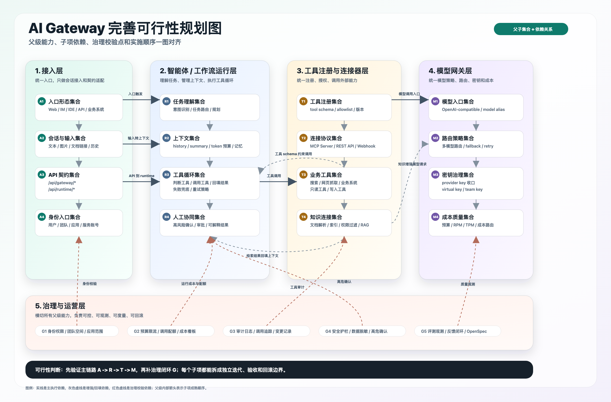
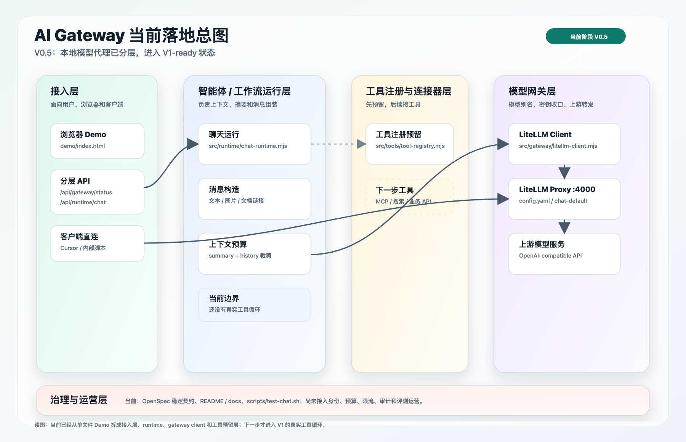
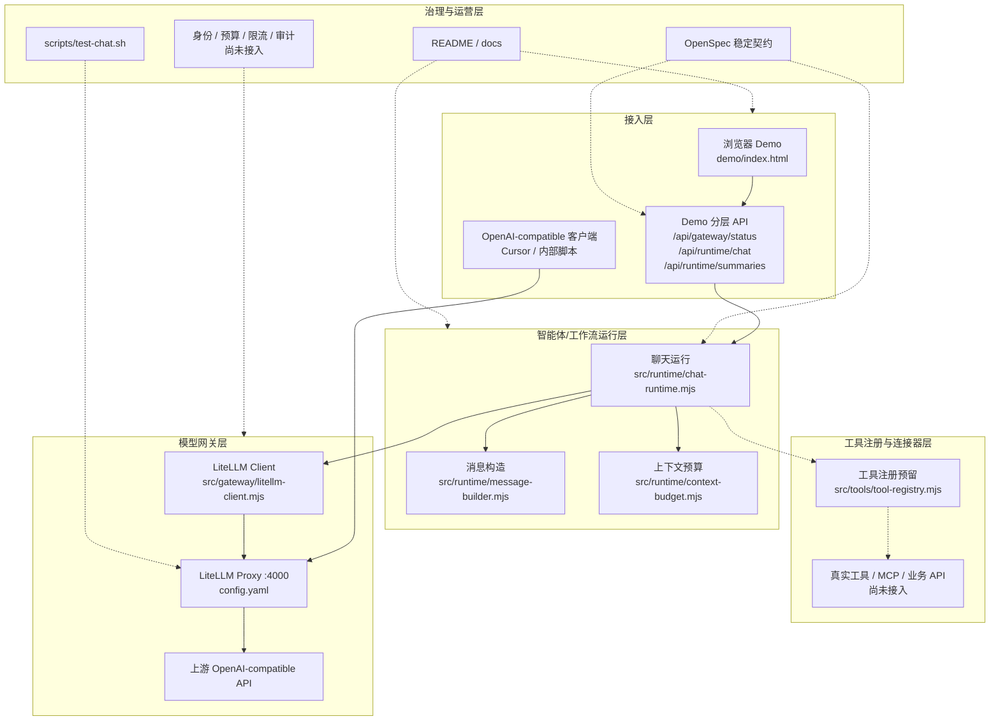
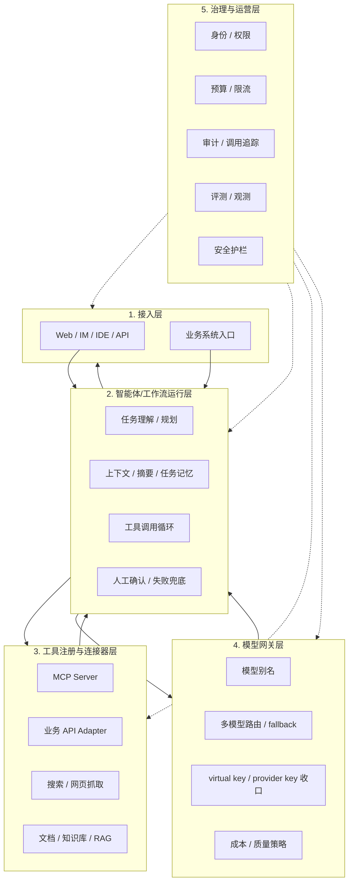
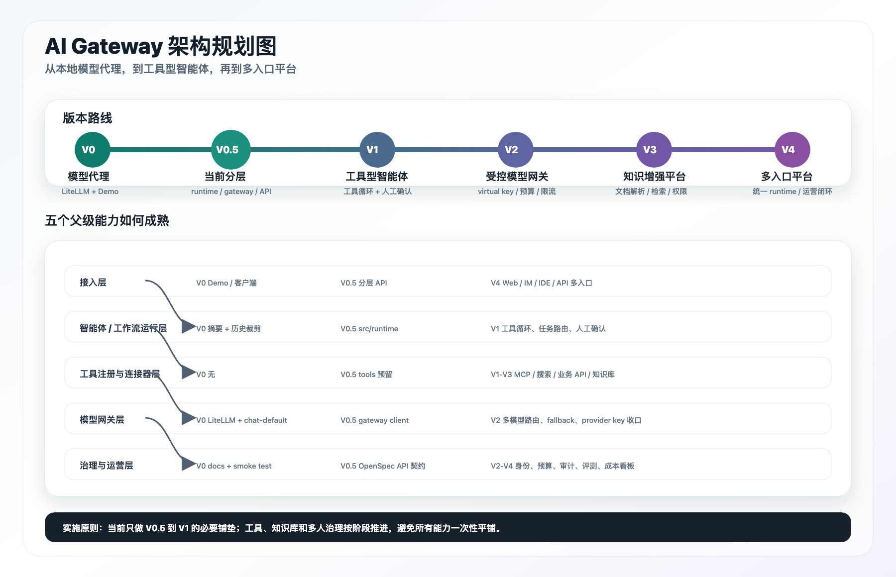
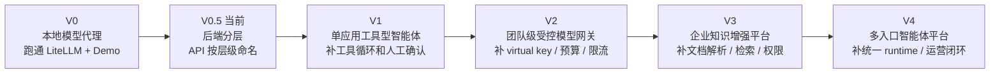
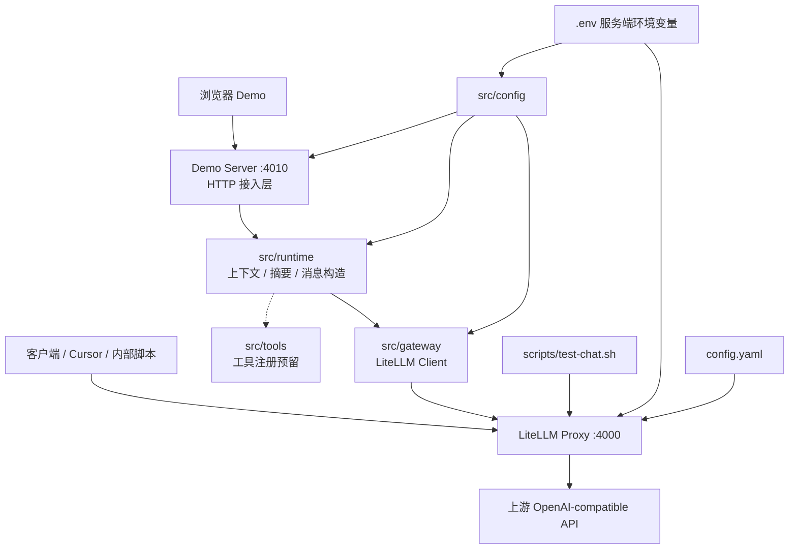
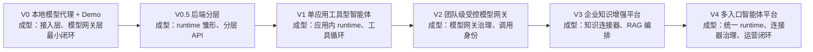

# AI 结构说明

## 项目重新定义

当前项目重新定义为一个按父级能力逐步完善的轻量 AI Gateway。它不是单纯的 LiteLLM Proxy 包装，也不是一次性建设完整智能体平台，而是以 LiteLLM 作为模型网关底座，把接入、Runtime、工具连接、模型治理和运营治理拆成可以分阶段成熟的父级集合。

五个父级是后续所有规划和实现的归属边界：

- 接入层：负责 Demo、客户端、内部脚本，后续扩展到业务系统、IM、IDE 和 API。
- 智能体/工作流运行层：负责任务理解、上下文、摘要记忆、工具循环、结果组装和人工确认。
- 工具注册与连接器层：负责 MCP、业务 API、搜索/网页、文档解析、知识库和 RAG 连接器。
- 模型网关层：负责 LiteLLM、模型别名、多模型路由、fallback、provider key 收口和成本策略。
- 治理与运营层：负责身份、权限、预算、限流、审计、观测、评测、反馈闭环和安全护栏。

当前代码只落地这个目标结构里的轻量切片：浏览器 Demo 和客户端接入、Demo Runtime、LiteLLM 调用封装、上下文预算与摘要记忆、工具注册预留，以及 OpenSpec/docs/smoke test 的最小治理。MCP、RAG、多人 key、预算、审计、统一运营平台仍属于后续规划，不作为当前稳定能力。

## 架构总图与实施对齐

这部分用于统一对齐：目标结构有哪些父级与子项，当前项目已经落到哪一层，后续每个版本要补哪一层。读图时先看完善可行性规划图，再看当前落地总图和规划实施图，最后用实施对比表判断当前改动应该落在哪个父级。

### 完善可行性规划图

这张图按“父级能力 -> 子项依赖 -> 治理校验点 -> 实施顺序”组织，用于判断架构完善的可行性和后续拆解边界。



### 当前落地总图

当前代码处于 `V0.5`：已经完成本地模型代理、Demo 接入、上下文预算、摘要记忆和后端分层，但还没有真实工具循环、知识库、多人治理和平台运营能力。





### 目标平台总图

目标形态不是把所有功能平铺，而是把能力挂到五个父级下。MCP、搜索、RAG、预算、审计都不是独立顶层，它们分别属于工具连接、知识接入、模型治理或运营治理。



### 规划实施图

每个版本只重点成熟一到两个父级，避免一次性把网关、工具、知识库和运营平台都做成半成品。





### 实施对比表

| 阶段 | 主要目标 | 成熟父级 | 应该落地 | 暂不做 |
| --- | --- | --- | --- | --- |
| V0 | 跑通本地代理和 Demo | 接入层、模型网关层 | LiteLLM、模型别名、Demo、smoke test | 工具、知识库、多人治理 |
| V0.5 当前 | 把 Demo 从单文件拆成可演进结构 | 接入层、runtime 雏形、gateway client | 分层 API、`src/runtime/`、`src/gateway/`、`src/tools/` 预留 | 真实工具循环、MCP、RAG、virtual key |
| V1 | 单应用具备工具型智能体能力 | 智能体/工作流运行层、工具注册与连接器层 | task router、工具 allowlist、工具调用循环、人工确认 | 平台化工具市场、复杂权限系统 |
| V2 | 团队共享模型入口且可治理 | 模型网关层、治理与运营层 | LiteLLM database、virtual key、预算、限流、审计 | 统一企业知识平台 |
| V3 | 企业知识可被可靠引用 | 工具注册与连接器层、runtime | 文档解析、检索、权限过滤、引用来源、缓存删除边界 | 多入口统一运营平台 |
| V4 | 多入口、多团队复用智能体平台 | 五个父级整体成型 | 多入口接入、workflow 模板、连接器生命周期、评测运营闭环 | 单场景临时堆功能 |

## 分层结构

### 当前运行结构



### 平台父级职责

后续规划参考主流企业级智能体平台形态推进：接入层负责入口，智能体/工作流运行层负责计划、上下文和工具循环，工具注册与连接器层负责外部能力接入，模型网关层负责模型路由和密钥治理，治理与运营层横切全链路。不要把 MCP、搜索、RAG、预算、审计等功能点都拆成平级模块；它们应挂在对应父级能力下。

| 父级 | 放什么 | 当前状态 |
| --- | --- | --- |
| 接入层 | Demo、客户端、未来的业务系统/IM/内部工具入口 | 已有 Demo 和客户端直连方式 |
| 智能体/工作流运行层 | 任务理解、上下文/记忆、工具调用循环、结果组装、人工确认 | 已有上下文、摘要和 token 裁剪；尚未形成工具循环 |
| 工具注册与连接器层 | MCP Server、业务 API、搜索/网页、文档/知识库连接器 | 已预留工具注册入口；尚未接入真实工具 |
| 模型网关层 | LiteLLM、模型别名、多模型路由、fallback、provider key 收口 | 已有 LiteLLM 和 `chat-default` |
| 治理与运营层 | 身份、权限、预算、限流、审计、日志、评测、观测、安全护栏 | 仅有文档约束和本地 smoke test |

参考形态：

- OpenAI Agents SDK 把工具、交接、会话、追踪和安全护栏放在智能体运行体系内。
- Amazon Bedrock Agents 通过动作组执行动作，通过知识库接入知识，并可关联安全护栏。
- Microsoft Foundry Agent Service 强调托管智能体、工具、身份、记忆和可观测性。
- Google Gemini Enterprise Agent Platform 强调企业智能体的构建、扩展、治理和优化。

## 入口与职责

| 层级 | 文件 | 职责 |
| --- | --- | --- |
| 使用说明 | `README.md` | 启动、测试、客户端配置、后续升级方向 |
| 协作入口 | `AGENTS.md` | AI 协作规则、文档路由、OpenSpec 同步判断 |
| 稳定契约 | `openspec/specs/ai-gateway/spec.md` | 固化代理、鉴权、模型别名、Demo API 和上下文预算能力 |
| Proxy 配置 | `config.yaml` | `chat-default` 到真实上游模型的映射、上游 base/key、master key |
| 容器启动 | `docker-compose.yml` | 启动 LiteLLM Proxy，挂载 `config.yaml`，读取 `.env` |
| Smoke test | `scripts/test-chat.sh` | 用 `LITELLM_MASTER_KEY` 调本地 `/v1/chat/completions` |
| Demo Server | `scripts/demo-server.mjs` | 接入层，只负责静态页面、分层 API 路由、JSON 收发和错误返回 |
| Demo UI | `demo/index.html` | 浏览器聊天界面，支持文本、图片、文档链接和本地上下文 |
| 配置加载 | `src/config/env.mjs` | 读取 `.env`，生成 Demo Server、runtime 和 gateway client 所需配置 |
| Runtime | `src/runtime/` | 负责聊天运行、摘要压缩、上下文预算、消息构造和输入校验 |
| Gateway Client | `src/gateway/litellm-client.mjs` | 封装 LiteLLM `/v1/models` 和 `/v1/chat/completions` 调用 |
| Tool Registry | `src/tools/tool-registry.mjs` | 预留工具注册和工具意图判断入口，当前不启用真实工具循环 |

Demo Server 对浏览器暴露的分层 API：

| API | 所属层级 | 职责 |
| --- | --- | --- |
| `GET /api/gateway/status` | 模型网关层 | 检查 LiteLLM 连接状态，返回 gateway base url 和模型别名 |
| `POST /api/runtime/chat` | 智能体/工作流运行层 | 接收当前消息、图片、文档链接、摘要和历史，返回助手回复 |
| `POST /api/runtime/summaries` | 智能体/工作流运行层 | 将旧历史压缩成后续请求可复用的摘要 |

## 调用链路

### 客户端直连 LiteLLM

```text
客户端
  -> http://localhost:4000/v1/chat/completions
  -> Authorization: Bearer LITELLM_MASTER_KEY
  -> model: chat-default
  -> LiteLLM 读取 config.yaml
  -> 命中真实模型 openai/gpt-5.5
  -> 使用 UPSTREAM_API_BASE + UPSTREAM_API_KEY 调用上游
  -> 返回 OpenAI-compatible 响应
```

### 浏览器 Demo 链路

```text
浏览器 Demo
  -> POST /api/runtime/chat
  -> Demo Server 接收请求并交给 runtime
  -> Runtime 组装 messages、图片 URL、文档链接文本、摘要和最近历史
  -> Gateway Client 使用 LITELLM_MASTER_KEY 调 LiteLLM
  -> LiteLLM 转发到上游
  -> Runtime 抽取 choices[0].message.content
  -> Demo Server 返回浏览器
```

浏览器不会接触 `UPSTREAM_API_KEY`，也不直接调用上游中转站。

## 配置边界

| 变量或配置 | 所在位置 | 说明 |
| --- | --- | --- |
| `UPSTREAM_API_BASE` | `.env` | 上游 OpenAI-compatible 地址，通常带 `/v1` |
| `UPSTREAM_API_KEY` | `.env` | 上游真实 key，只能服务端使用 |
| `LITELLM_MASTER_KEY` | `.env` | 本地 LiteLLM 对外访问 key |
| `LITELLM_BASE_URL` | `.env` 可选 | Demo Server 调用 LiteLLM 的地址，默认 `http://localhost:4000` |
| `LITELLM_MODEL` | `.env` 可选 | Demo Server 使用的模型别名，默认 `chat-default` |
| `DEMO_MAX_CONTEXT_TOKENS` | `.env` 可选 | Demo 上下文预算，默认 `12000` |
| `model_list[].model_name` | `config.yaml` | 对外模型别名，目前是 `chat-default` |
| `model_list[].litellm_params.model` | `config.yaml` | 上游真实模型名，目前是 `openai/gpt-5.5` |

## 当前 AI 能力边界

已具备：

- OpenAI-compatible chat completions 代理。
- 服务端密钥收口。
- 单模型别名路由。
- 本地 smoke test。
- 本地浏览器 Demo。
- 图片 URL / 图片 data URL 转发。
- 文档链接作为文本上下文附加。
- 最近对话上下文、摘要记忆和估算 token 预算裁剪。
- 后端已拆出接入层、runtime、LiteLLM client 和工具注册预留层。

暂未覆盖：

- 多用户 virtual key 管理。
- 团队、用户、模型维度预算。
- RPM/TPM 限流策略。
- 细粒度调用统计和审计。
- 多上游 fallback。
- 后台管理页面。
- 私有文档抓取、网页解析或文档内图片提取。

## 版本架构演进规划

版本规划按“系统形态”推进，而不是按功能清单堆叠。每个版本都要回答：当前系统是哪种架构、哪些父级已经成型、哪些父级仍保持最小实现。

读图方式：每一版只重点成熟一到两个父级能力，其他父级保持够用，不提前平台化。当前项目处于 `V0.5`。



### 版本矩阵

| 版本 | 系统形态 | 接入层 | 智能体/工作流运行层 | 工具注册与连接器层 | 模型网关层 | 治理与运营层 |
| --- | --- | --- | --- | --- | --- | --- |
| V0 | 本地模型代理 + Demo | Demo、客户端直连 | 上下文摘要和 token 裁剪 | 无 | 单 LiteLLM、单模型别名 | 文档约束、smoke test |
| V0.5 当前 | 分层 Demo Runtime | 分层 API、Demo | `src/runtime/` 承接聊天、摘要、预算 | `src/tools/` 预留入口 | `src/gateway/` 封装 LiteLLM 调用 | OpenSpec、docs、smoke test |
| V1 | 单应用工具型智能体 | Demo / API | 任务路由、工具循环、人工确认点 | 少量工具、MCP/API 连接器 | 继续复用 LiteLLM | 工具 allowlist、基础日志 |
| V2 | 团队级受控模型网关 | 小团队客户端 / 内部服务 | 应用侧 runtime 继续保留 | 工具注册先不平台化 | virtual key、多模型路由、fallback | 身份、预算、限流、审计 |
| V3 | 企业知识增强平台 | 业务入口 + 知识入口 | RAG 编排、引用、任务记忆 | 文档解析、索引、权限过滤、业务数据连接器 | 网关承接模型策略 | 数据权限、脱敏、工具审计 |
| V4 | 多入口智能体平台 | IM / Web / IDE / API 多入口 | workflow 模板、多智能体、任务状态 | 连接器生命周期和工具市场 | 多供应商统一策略 | 观测、评测、成本、护栏、运营闭环 |

### V0 本地模型代理 + Demo

架构形态：

```text
Demo / 客户端
  -> Demo Server 或 LiteLLM
  -> LiteLLM Proxy
  -> 上游 OpenAI-compatible API
```

本版定位是验证模型代理链路，不承担企业级平台职责。

父级状态：

- 接入层：已有浏览器 Demo 和 OpenAI-compatible 客户端接入方式。
- 智能体/工作流运行层：只有轻量上下文、摘要记忆和 token 预算裁剪，还不是完整工具循环。
- 工具注册与连接器层：不接外部工具。
- 模型网关层：LiteLLM 负责 `chat-default` 到真实模型的映射和 key 收口。
- 治理与运营层：依赖 README、OpenSpec 和 smoke test 做最小约束。

进入下一版的条件：

- 模型代理链路稳定。
- Demo 能支持多轮上下文和多模态输入。
- 需要把 Demo Server 从单文件实现拆成可演进结构。

### V0.5 分层 Demo Runtime

架构形态：

```text
浏览器 Demo
  -> 分层 API
  -> 接入层 Demo Server
  -> src/runtime
  -> src/gateway
  -> LiteLLM
  -> 上游模型
```

本版定位是把代码结构调到 V1-ready，但不提前引入真实工具、RAG 或多人治理。

父级状态：

- 接入层：Demo Server 只负责静态资源、分层 API 路由、JSON 收发和错误返回。
- 智能体/工作流运行层：`src/runtime/` 承接聊天运行、摘要压缩、上下文预算和消息构造。
- 工具注册与连接器层：`src/tools/tool-registry.mjs` 只作为预留入口，不启用真实工具循环。
- 模型网关层：`src/gateway/litellm-client.mjs` 封装 LiteLLM 调用。
- 治理与运营层：OpenSpec、README、docs 和 smoke test 继续作为最小治理手段。

进入下一版的条件：

- 分层 API 稳定。
- 至少确认一个真实工具场景，例如网页抓取、搜索、业务 API 或 MCP Server。
- 明确哪些工具需要人工确认，哪些工具只读可自动调用。

### V1 单应用工具型智能体

架构形态：

```text
Demo / API
  -> Demo Server 内部 runtime
      -> 判断是否需要工具
      -> 调用工具
      -> 回填工具结果
  -> LiteLLM
  -> 上游模型
```

本版目标不是做平台，而是让一个应用具备最小工具循环。

父级状态：

- 接入层：仍以 Demo 或轻量 API 为主。
- 智能体/工作流运行层：新增 `taskRouter`、工具调用循环、工具结果组装、人工确认点。
- 工具注册与连接器层：先做本地工具清单，可接 `search`、`fetchPage`、业务 API adapter 或外部 MCP Server。
- 模型网关层：继续复用 LiteLLM，不把业务工具编排塞进网关。
- 治理与运营层：增加工具 allowlist、基础调用日志和高风险动作确认。

进入下一版的条件：

- 至少一个工具链路真实跑通。
- 能区分普通问答、查外部数据、需要人工确认三类请求。
- 工具调用失败时有兜底回答。

### V2 团队级受控模型网关

架构形态：

```text
多个内部调用方
  -> 统一 gateway endpoint / 模型别名
  -> LiteLLM database / virtual key / 路由策略
  -> 多上游模型
```

本版重点是把模型访问变成团队级受控基础设施。

父级状态：

- 接入层：从 Demo 扩到小团队客户端、内部脚本和业务服务。
- 智能体/工作流运行层：仍由具体应用持有，不上升为统一平台 runtime。
- 工具注册与连接器层：可继续保持 V1 的应用内工具，不急着平台化。
- 模型网关层：引入 LiteLLM database、virtual key、多模型路由、fallback、provider key 管理。
- 治理与运营层：补身份、团队、预算、RPM/TPM 限流、基础审计和调用统计。

进入下一版的条件：

- 多人/多服务共用 gateway 时仍能区分调用身份。
- 能控制不同用户或团队的预算和限流。
- 模型路由和 fallback 策略可配置、可追踪。

### V3 企业知识增强平台

架构形态：

```text
业务问题
  -> 智能体/工作流运行层
  -> 知识库 / 文档 / 业务数据连接器
  -> RAG 上下文
  -> 模型网关
  -> 带引用和权限边界的回答
```

本版重点是把“文档链接只是文本”升级为真正的企业知识接入。

父级状态：

- 接入层：增加文档、知识库或业务入口。
- 智能体/工作流运行层：负责 RAG 编排、引用来源、超长文档摘要和任务级记忆。
- 工具注册与连接器层：形成文档解析、OCR、表格解析、向量检索、权限过滤、业务数据连接器。
- 模型网关层：继续承接模型策略，不保存业务知识权限逻辑。
- 治理与运营层：补知识访问权限、数据脱敏、工具调用审计和引用追踪。

进入下一版的条件：

- 能稳定回答内部知识问题并返回来源。
- 权限过滤在检索前或检索时生效。
- 文档解析、索引、缓存和删除有明确边界。

### V4 多入口智能体平台

架构形态：

```text
IM / Web / IDE / API 多入口
  -> 统一智能体/工作流运行层
  -> 工具注册与连接器层
  -> 模型网关层
  -> 治理与运营层横切全链路
```

本版才进入平台化阶段，重点是多入口、多场景、多团队复用。

父级状态：

- 接入层：接入飞书/企微/钉钉、Web、IDE、内部 API。
- 智能体/工作流运行层：沉淀 workflow 模板、多智能体协同、任务状态、人工协同和失败兜底。
- 工具注册与连接器层：管理连接器生命周期、工具权限、工具版本和工具市场。
- 模型网关层：支撑多供应商统一策略、fallback、成本和质量路由。
- 治理与运营层：形成审计、成本看板、质量评测、调用追踪、反馈闭环和安全护栏。

进入下一阶段的条件：

- V1-V3 至少有一条真实业务链路跑通并可度量。
- 有跨入口复用需求，而不是只有单个 Demo 或单个业务场景。
- 评测和监控围绕业务任务效果，而不是只看模型调用成功率。

## 变更同步原则

需要同步 `openspec/` 的变更：

- 改 `chat-default` 的语义或模型别名策略。
- 改 LiteLLM 鉴权方式或 key 边界。
- 改 Demo Server API 路径、请求体或返回体。
- 改上下文摘要、历史裁剪、图片/文档链接输入契约。
- 新增 virtual key、预算、限流、统计等稳定能力。

只更新 `docs/` 或 `README.md` 通常足够的变更：

- 启动说明、使用说明、示例命令调整。
- Demo 页面文案或样式微调。
- 不改变接口和行为的内部重排。
