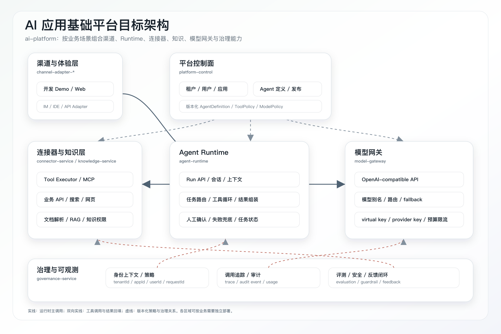
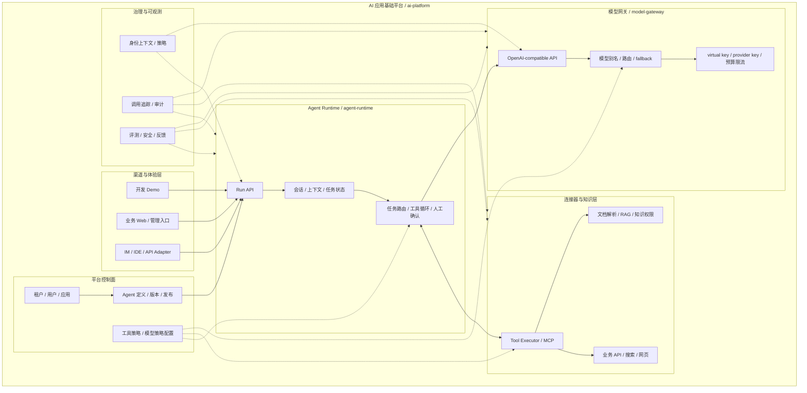
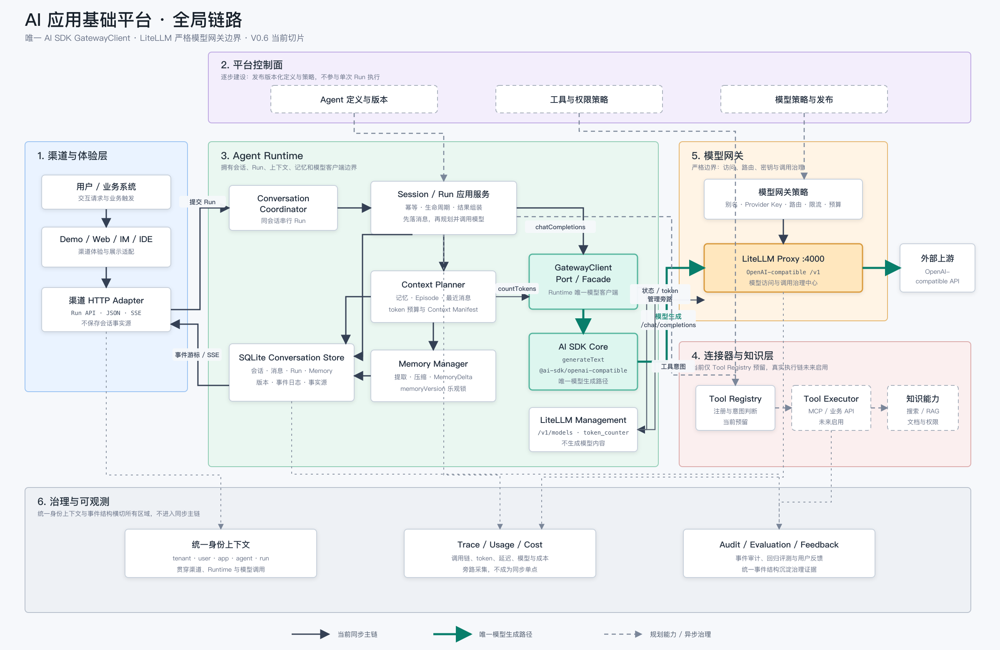
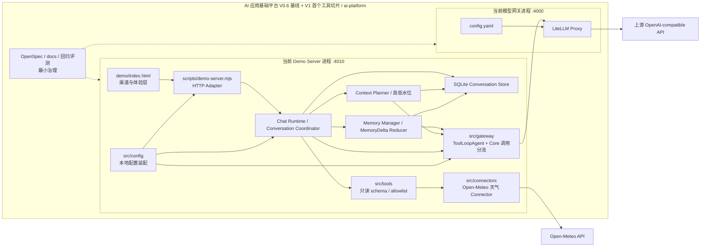
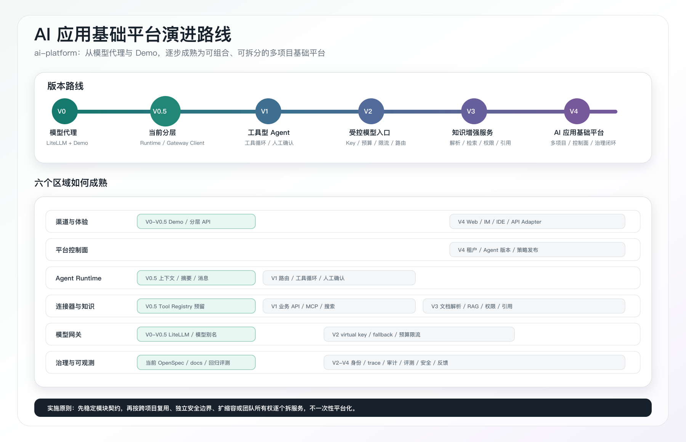

# AI 应用基础平台架构说明

## 项目定位

项目总称为“AI 应用基础平台”，项目、仓库和目录统一使用 `ai-platform`，面向不同业务场景按需组合渠道、Agent Runtime、连接器、知识、模型网关和治理能力。拆出的模型网关服务使用 `model-gateway`。

系统中只有模型访问、模型路由、模型密钥和模型调用治理属于严格意义上的 AI Gateway；渠道、平台管理、Agent Runtime、工具和知识连接属于独立架构区域。项目改名不改变这个职责边界，也不改变当前稳定 API 行为。

当前阶段仍使用单仓和轻量本地部署验证完整调用链路，不提前拆成微服务。所有新增能力必须先归入明确区域，并通过稳定接口交互，确保未来可以按项目需要独立部署和复用。

## 六个架构区域

| 区域 | 核心职责 | 明确不负责 | 当前落地 |
| --- | --- | --- | --- |
| 渠道与体验层 | Demo、Web、IM、IDE、API 等入口适配；输入输出格式转换 | Agent 编排、工具执行、模型供应商密钥 | `demo/index.html`、`scripts/demo-server.mjs` 的静态页面和 HTTP 接入部分 |
| 平台控制面 | 租户、用户、应用、Agent 定义、版本发布、配置和运营入口 | 执行单次 Agent 任务、直接调用上游模型 | 尚未实现；未来的大平台属于此区域，不只是更大的 Demo |
| Agent Runtime | 会话、上下文、任务路由、模型调用编排、工具循环、结果组装、结果验收、人工确认 | 保存 provider key、实现具体业务连接器、承载管理后台 | 已有持久化会话、幂等 Run、结构化记忆、Context Planner、token 水位、GatewayClient、有界只读工具循环、ToolResult 事实、受限重启恢复和天气 AcceptanceResult |
| 连接器与知识层 | 工具注册与执行、MCP、业务 API、搜索、网页、文档解析、RAG 和知识权限适配 | 决定完整任务流程、模型路由和模型预算 | 已有只读 Tool Registry 和 Open-Meteo 天气 Connector；MCP、企业业务连接器和知识能力尚未实现 |
| 模型网关 | OpenAI-compatible API、模型别名、provider 适配、virtual key、路由、fallback、模型预算和限流 | 会话、工具循环、业务流程、文档知识 | 已有 LiteLLM、`chat-default` 和上游 key 收口 |
| 治理与可观测 | 身份上下文、策略、审计事件、调用追踪、评测、安全和反馈闭环 | 代替各区域执行核心业务 | 已有默认关闭的 C1 ChainTracer + OTel 旁路、Phoenix + PostgreSQL 选型与部署入口、回归评测和治理契约；真实 Runtime Trace、审计与反馈仍未完成 |

这六个区域是概念、代码和未来服务拆分的统一归属边界。MCP、RAG、预算、审计等不是新的平级平台：MCP 和 RAG 属于连接器与知识层，模型预算属于模型网关，工具审批和任务评测属于 Agent Runtime 与治理区域。

## 目标架构



PNG 用于快速阅读和分享，下面的 Mermaid 是可检索、可维护的结构事实源。



图中的实线表示运行时主调用方向，虚线表示配置或治理关系。平台控制面发布配置，不进入每次请求的核心同步链路；治理区域接收统一事件并下发策略，不接管各区域的业务职责。

## 控制面与数据面

为了后续拆服务，需要先区分两类运行性质：

| 平面 | 包含区域 | 特征 |
| --- | --- | --- |
| 控制面 | 平台控制面、治理策略配置 | 低频写入；管理租户、Agent 版本、工具和模型策略；向数据面发布不可变版本 |
| 数据面 | 渠道适配、Agent Runtime、连接器与知识、模型网关 | 高频执行；按已发布配置处理请求；不得在单次调用中隐式修改平台配置 |

治理与可观测横跨两个平面：策略配置属于控制面，追踪、审计和评测事件采集属于数据面旁路。

## 依赖规则

区域之间只允许以下主依赖：

```text
渠道与体验层
    -> Agent Runtime API

平台控制面
    -> 发布 AgentDefinition / ToolPolicy / ModelPolicy

Agent Runtime
    -> Connector API
    -> Model Gateway API

各区域
    -> Governance Event API
```

必须守住这些边界：

- 渠道只做协议和展示适配；正式平台与 Demo 可以并存，不需要互相替换。
- 平台业务模型请求必须经过 Agent Runtime；`scripts/test-chat.sh` 直连模型网关仅用于连通性 smoke test，不属于平台业务入口或全局依赖。
- Agent Runtime 只使用模型别名或逻辑模型能力，不读取 `UPSTREAM_API_KEY`，不依赖具体 provider。
- 连接器执行外部能力，但不自行决定完整任务流程；工具选择、循环次数和人工确认由 Agent Runtime 控制。
- 模型网关只处理模型调用，不保存业务会话、任务状态、工具结果或知识权限。
- 平台控制面通过版本化配置影响执行，不直接嵌入 Runtime、连接器或模型网关的内部实现。
- 治理事件采用统一结构旁路采集；不得让日志、评测或审计服务成为所有请求的单点同步阻塞。

## 架构模式与设计原则

本架构使用以下模式解决明确的变化点：

- Ports and Adapters：Demo、Web、IM 和 IDE 是入站 Adapter；模型网关客户端和连接器客户端是出站 Adapter；Agent Runtime 只依赖稳定端口，不依赖具体渠道、LiteLLM 或业务 API 实现。
- Control Plane / Data Plane：平台控制面发布版本化配置，数据面按不可变版本执行，避免管理操作和高频任务执行相互耦合。
- Registry：连接器区域通过 Tool Registry 管理工具描述和实现映射，Runtime 只按工具契约选择和调用，不维护业务连接器分支。
- Strategy Registry：结果验收策略按工具事实注册，Runtime 只执行统一候选门禁，不把天气等领域规则写进主流程分支。
- Event-driven Observation：治理与可观测通过统一事件旁路采集 trace、audit 和 evaluation 数据，不侵入各区域核心执行逻辑。
- Compatibility Adapter：拆服务期间保留现有 Demo API 作为兼容 Adapter，逐步把内部调用切到新服务契约，避免页面和后端一次性迁移。

具体设计原则：

- 单一职责：每个区域只拥有一种主要变化原因，模型供应商变化不应迫使平台页面或工具执行逻辑一起修改。
- 依赖倒置：Runtime 依赖 Model Gateway Port 和 Connector Port，具体 HTTP 客户端、LiteLLM 和业务 Adapter 位于边界外侧。
- 高内聚低耦合：会话和任务状态集中在 Runtime，工具与凭据集中在连接器，模型路由与 provider key 集中在模型网关。
- KISS 与 YAGNI：当前先保持单仓和模块调用，只有拆分触发条件成立后才引入数据库、消息系统和网络服务。
- 数据所有权：每类事实数据只有一个写入所有者，跨区域只通过 API、版本化配置或事件共享。

## 可插拔边界

可插拔不是替换整个后端，而是让区域通过稳定契约独立变化。

### 渠道适配契约

Demo、正式 Web 平台、飞书、IDE 和 API Adapter 都应转换为统一的 `RunRequest`，至少携带：

| 字段 | 说明 |
| --- | --- |
| `requestId` | 全链路唯一请求标识 |
| `tenantId` | 租户或组织标识；本地 Demo 可以使用固定开发值 |
| `appId` | 调用应用或 Agent 所属应用 |
| `userId` | 最终用户或服务身份 |
| `agentId`、`agentVersion` | 运行的 Agent 定义和不可变版本 |
| `conversationId` | 会话标识；无会话请求可为空 |
| `input` | 当前文本或结构化输入 |
| `attachments` | 图片、文档等附件引用 |

渠道层不能把浏览器或 IM 平台特有字段直接渗透到 Runtime 核心结构。

### 平台配置契约

平台控制面向执行区域发布三类版本化配置：

- `AgentDefinition`：系统提示词、模型策略引用、可用工具集合、上下文策略和人工确认规则。
- `ToolPolicy`：工具 allowlist、参数边界、凭据引用、超时、结果大小和风险等级。
- `ModelPolicy`：模型别名、候选模型、fallback、预算、限流和质量/成本策略。

运行请求引用已发布版本，不读取管理页面的临时编辑状态。

### Runtime 到模型网关契约

- 保持 OpenAI-compatible 或明确版本化的内部模型接口。
- Runtime 只传模型别名、消息、工具描述和生成参数。
- 通过 header 或请求元数据透传 `requestId`、`tenantId`、`appId` 和 `userId`。
- 模型网关返回标准响应、usage、实际模型、路由结果和可追踪错误，不返回 provider key。

### Runtime 到连接器契约

- Runtime 发送版本化 `ToolInvocation`，包含工具名、参数、调用身份、风险等级和确认状态。
- 连接器负责 schema 校验、凭据引用解析、超时、重试和结果大小限制。
- 返回结构化 `ToolResult`，明确成功、失败、可重试性和脱敏后的结果。
- 写操作必须带有效确认凭证；连接器不能只依赖前端传入的布尔值放行。

## 数据所有权

服务能否独立拆分，核心不在目录，而在数据是否有唯一所有者。

| 区域 | 独占数据 | 其他区域如何使用 |
| --- | --- | --- |
| 渠道与体验层 | 渠道账号映射、展示偏好、临时交互状态 | 转换为统一身份和 `RunRequest` |
| 平台控制面 | 租户、用户、应用、Agent 定义、发布版本和策略引用 | 通过版本化配置 API 或配置事件分发 |
| Agent Runtime | Run、会话、任务状态、checkpoint、短期记忆和确认状态 | 通过 Run/Session API 查询，不允许跨服务直接写库 |
| 连接器与知识层 | 工具定义、连接器实例、凭据引用、索引元数据和知识权限映射 | 通过 Tool/Knowledge API 使用 |
| 模型网关 | virtual key、provider 配置、模型路由、预算和模型调用 usage | 通过模型 API 和用量查询 API 使用 |
| 治理与可观测 | trace、audit event、evaluation result、feedback | 通过事件和只读查询接口使用 |

禁止多个服务共同写同一张表。真正拆分前，先完成数据所有权迁移，再把模块改成网络服务。

## 独立服务拆分蓝图

当前不要求一次性拆完。每个区域只有在出现独立扩缩容、独立安全边界、跨项目复用或独立团队所有权时，才值得成为服务。

| 候选服务 | 来源区域 | 适合拆出的触发条件 | 对外主要契约 |
| --- | --- | --- | --- |
| `channel-adapter-*` | 渠道与体验层 | 接入飞书、IDE 等独立渠道，发布节奏不同 | `RunRequest` / 渠道消息回写 |
| `platform-control` | 平台控制面 | 多租户、多应用、需要 Agent 配置和发布管理 | Tenant/App/Agent/Policy API |
| `agent-runtime` | Agent Runtime | 多个项目复用统一会话、任务和工具循环 | Run/Session/Confirmation API |
| `connector-service` | 连接器与知识层 | 多项目共享 MCP、业务 API 或连接器凭据 | Tool Registry/Invocation API |
| `knowledge-service` | 连接器与知识层 | 文档解析、索引和检索需要独立资源或权限边界 | Ingest/Search/Citation API |
| `model-gateway` | 模型网关 | 多项目共享模型入口，需要独立预算、限流和路由 | OpenAI-compatible API / Key/Usage API |
| `governance-service` | 治理与可观测 | 需要统一 trace、审计、评测和成本分析 | Event Ingest/Trace/Evaluation API |

推荐拆分顺序：

`ai-platform` 是总项目或总仓库名，不作为一个必须单独部署的服务；表中的候选服务可以按业务场景选用。

1. 保持 LiteLLM 为独立 `model-gateway`，当前已经具备这个部署边界。
2. 把 `src/runtime/` 稳定为无渠道依赖的 `agent-runtime` 模块，再按复用需求独立部署。
3. 当前先在单仓内稳定首个只读工具的 schema、执行、ToolResult 和固定端点边界；出现多个跨项目 Connector 或独立凭据边界后，再拆出 `connector-service`。
4. 出现文档解析、索引资源或知识权限需求时，再从连接器区域拆出 `knowledge-service`。
5. 出现多个项目、租户和 Agent 版本管理需求后，再建设 `platform-control`。
6. 调用规模和治理要求上升后，把统一事件采集、评测和审计查询拆成 `governance-service`。

## 当前代码映射

当前在 `V0.6` 会话数据面基线上开始交付 V1：保留模块化 Demo Runtime 和独立 LiteLLM Proxy，并加入首个有界只读天气工具闭环。下图是 V0.6 基线，后面的 Mermaid 是当前可检索代码映射：



基线图突出唯一 AI SDK 模型生成路径、LiteLLM 管理旁路和六个架构区域；模型连通性测试链被有意排除。[查看动态数据流图](./assets/ai-platform-data-flow-v3.html)，[SVG 源文件](./assets/ai-platform-global-chain-v2.svg)保留 V0.6 快照。下面的 Mermaid 已同步 V1 首个工具切片。



| 当前文件 | 归属区域 | 后续拆分方向 |
| --- | --- | --- |
| `demo/src/`、`demo/index.html` | 渠道与体验层 | 保留为开发 Demo；正式平台作为另一个调用方并存 |
| `scripts/demo-server.mjs` | 渠道 HTTP Adapter 与本地装配入口 | 渠道路由留在 adapter；Runtime 通过稳定 API 或模块接口调用 |
| `src/runtime/chat-runtime.mjs`、`conversation-coordinator.mjs`、`result-acceptance.mjs` | Agent Runtime | 稳定 Session/Run、恢复和验收契约后可独立为 `agent-runtime` |
| `src/runtime/context-planner.mjs`、`memory-manager.mjs` | Agent Runtime | 上下文策略和结构化记忆保持 Runtime 所有 |
| `src/storage/conversation-store.mjs` | Agent Runtime 数据面 | 本地 SQLite 可迁移到独立 Runtime 数据库 |
| `src/tools/`、`src/connectors/` | 连接器与知识层 | 当前承载只读 Registry 和天气 Adapter；出现跨项目复用或独立凭据边界后可拆为 `connector-service` |
| `src/gateway/gateway-contract.mjs`、`gateway-client.mjs`、`litellm-management-client.mjs` | Runtime 到模型网关的 AI SDK 客户端边界 | 模型生成统一使用 AI SDK；LiteLLM 管理端点保持独立，不承载模型网关服务端策略 |
| `config.yaml`、`docker-compose.yml` | 模型网关 | LiteLLM 独立部署和治理 |
| `openspec/`、调用日志和未来评测 | 治理与可观测 | 按区域建立契约，统一事件模型 |

## 当前 API 归属

| API | 当前提供者 | 目标归属 |
| --- | --- | --- |
| `GET /api/gateway/status` | Demo Server | 渠道层的聚合状态接口；底层调用模型网关健康检查 |
| `GET/POST /api/runtime/conversations` | Demo Server | Agent Runtime 的 Session API |
| `GET /api/runtime/conversations/{id}` | Demo Server | 会话、消息、结构化记忆、版本和 `latestRun.acceptance` 查询 |
| `PATCH /api/runtime/conversations/{id}` | Demo Server | 标题与独立归档状态更新，不改变会话生命周期 |
| `POST /api/runtime/conversations/{id}/runs` | Demo Server | 幂等 Run API |
| `POST /api/runtime/conversations/{id}/runs/stream` | Demo Server | POST SSE 模型文本增量和真实工具阶段；完成后返回同一 Run 的持久化最终结果 |
| `POST /api/runtime/conversations/{id}/runs/{runId}/cancel` | Demo Server | 取消当前模型、工具和后续重试，收口为独立 `cancelled` 状态 |
| `POST /api/runtime/conversations/{id}/close` | Demo Server | 会话结束和最终 checkpoint |
| `GET /api/runtime/conversations/{id}/events` | Demo Server | SQLite 事件游标驱动的持久化事实 SSE 增量同步 |
| `POST /v1/chat/completions` | LiteLLM | Runtime 使用的模型网关标准接口；`test-chat.sh` 仅作连通性诊断 |

未来拆出服务时，保持 Session/Run 契约不变，将 SQLite Store 替换为独立数据库和事件总线。

## 业务主链与模型测试

### 平台业务主链

所有平台业务请求统一经过 Agent Runtime，但不同输入源不能只用一张总图代替具体建设链路：

```text
Demo / 正式平台 / IM / API Adapter
  -> Agent Runtime
      -> Connector / Knowledge
      -> GatewayClient
      -> AI SDK Core + OpenAI-compatible Provider
      -> Model Gateway
  -> 最终结果或确认状态
```

对话、图片、文档、业务数据、实时事件、操作执行和批量分析分别需要不同的输入治理、上下文构造、结果校验、交互状态与质量指标。各场景的独立端到端链路、当前/目标边界、四维质量控制点和建议建设顺序见[场景化输入到大模型交互链路](./scenario-interaction-chains.md)。

当前阶段聚焦 C1 对话问答的功能可用、确定性回归和能力理解。正式实例、真实 Runtime `ChainTrace` 和完整四维运行态基线按触发条件恢复，不再作为当前功能迭代或其他低风险场景调研的硬门禁；任何后续场景仍必须满足自身的数据所有权、安全、错误语义和测试前置条件。

### 模型连通性测试（不属于全局链路）

`scripts/test-chat.sh` 只用于确认 LiteLLM、模型配置和上游是否正常：

```text
scripts/test-chat.sh
  -> LiteLLM /v1/chat/completions
  -> 上游模型
```

该链路固定归入 smoke test、CI 和运维排障，不属于平台业务能力、普通客户端接入方式、全局架构依赖或未来服务拆分依据。全局链路图、能力组成图和演进路线不得把它画成与 Agent Runtime 并列的调用入口。

## 配置与密钥边界

| 配置或凭据 | 所有区域 | 说明 |
| --- | --- | --- |
| `UPSTREAM_API_BASE`、`UPSTREAM_API_KEY` | 模型网关 | 只在模型网关服务端保存 |
| `LITELLM_MASTER_KEY` / virtual key | 模型网关 | 调用方只持有分配给自己的访问凭据 |
| 模型别名、fallback、预算和限流策略 | 模型网关 | 平台控制面可以管理策略引用，但不直接持有 provider key |
| Agent 提示词、工具集合、上下文策略 | 平台控制面 | 发布为不可变 `AgentDefinition`，Runtime 按版本读取 |
| 业务 API 和 MCP 凭据引用 | 连接器与知识层 | Runtime 只传工具调用身份，不读取真实凭据 |
| 会话、原始消息、结构化记忆、ToolResult、AcceptanceResult、任务和确认状态 | Agent Runtime | 不写入模型网关或渠道本地存储作为事实源 |

## 当前能力边界

已具备：

- OpenAI-compatible chat completions 代理。
- 服务端上游密钥收口和单模型别名路由。
- 浏览器 Demo 与分层 API。
- 文本、图片 URL、图片 data URL 和文档链接输入。
- SQLite 持久化多会话、幂等 Run、绝对截止时间、ToolResult、AcceptanceResult、POST SSE 模型文本流和独立的 SSE 多标签页事实同步。
- 结构化 MemoryDelta、来源追溯、memoryVersion 乐观锁和最终 checkpoint。
- Context Planner、模型网关 token counter 回退、高低水位和 Context Manifest。
- AI SDK Core v7 的 `ToolLoopAgent`、`generateText` / `streamText`、`Output.object` 与 OpenAI-compatible Provider 组成唯一 LiteLLM 模型生成客户端；AI SDK 内建重试保持关闭，由平台统一重试执行器按 Run 总时限控制模型尝试并持久化证据。
- 纯文本工具型对话复用 GatewayClient 生命周期内的 `ToolLoopAgent`，通过 `callOptionsSchema`、`prepareCall`、`prepareStep`、`runtimeContext` 和 `toolsContext` 提供最多四步的模型工具编排；Runtime 只在服务端确定性路由命中时开放对应受管工具。工具后模型失败且正文尚未交付时，可从 SQLite ToolResult 做无 ToolSet 总结恢复；Demo Server 重启后也能从 completed 已注册只读 ToolResult 继续原 Run。天气候选经独立策略验收后才交付和完成。Open-Meteo Connector 只负责固定端点天气读取。
- 版本化 Runtime Scenario Runner、固定行为模型、进程退出故障注入和独立场景验收；确定性链路与真实模型观察分开报告。
- 100 轮用户纠正、实体隔离、待办与来源追溯回归评测。
- Agent Runtime 及其 GatewayClient、只读 Tool Registry、天气 Connector 和模型网关的模块边界。
- OpenSpec、文档、回归评测和自动化架构边界检查的最小治理。

暂未覆盖：

- 平台控制面和正式多渠道接入。
- MCP、企业业务 API、搜索、知识工具、有副作用工具和人工确认。
- 私有文档解析、知识索引、RAG、引用和知识权限。
- 多用户 virtual key、预算、RPM/TPM 限流、调用统计和多上游 fallback。
- 多用户身份映射、跨主机数据库、统一 trace、审计和在线评测反馈闭环。
- 通用跨进程任务恢复、多实例接管、运行中工具 checkpoint、持久工作流和写副作用补偿；当前只覆盖 completed 只读 ToolResult 后最终总结的受限 R3。

## 演进路线

版本仍按可验证系统形态推进，但每一版明确成熟哪个架构区域：



| 阶段 | 系统形态 | 重点成熟区域 | 进入下一阶段的条件 |
| --- | --- | --- | --- |
| V0 | 本地模型代理 + Demo | 渠道与体验、模型网关 | 模型代理链路和 Demo 可用 |
| V0.5 | 分层 Demo Runtime | Agent Runtime 模块边界、模型网关客户端 | 分层 API 稳定 |
| V0.6 基线 | 持久化上下文 Runtime | 会话数据面、结构化记忆、Context Planner、并发和评测 | 上下文契约稳定；已选择第一个真实工具场景 |
| V1 当前建设 | 单应用工具型 Agent | Agent Runtime、连接器与知识、结果治理 | 天气只读闭环已达到受限 R3/A3 并进入进程故障回归；待真实模型质量、多实例协调和后续人工确认 |
| V2 | 团队级受控模型入口 | 模型网关、治理与可观测 | 多调用方身份可区分；预算、限流、路由和 fallback 可追踪 |
| V3 | 企业知识增强服务 | 连接器与知识、Agent Runtime | 文档解析、检索、权限和引用链路稳定 |
| V4 | AI 应用基础平台 | 平台控制面、渠道与体验、全链路治理 | 多项目复用 Runtime、连接器和模型网关；配置发布和运营闭环稳定 |

实施原则：当前只做 V0.6 到 V1 的必要工作。未来大平台作为新的平台控制面和渠道调用方接入，不替换 Runtime、连接器或模型网关；独立服务按复用和所有权需求逐个拆出，不把所有区域一次性平台化。

## OpenSpec 与文档边界

- `openspec/specs/ai-platform/spec.md` 固化 V0.6 Session/Run、结构化记忆、并发和上下文水位契约，以及 V1 首个只读工具循环契约。
- 首次真正拆出服务时，按模型网关、Agent Runtime、连接器或平台控制面分别建立稳定 spec，并在兼容期说明旧 API 到新服务契约的映射。
- 修改代理行为、鉴权、模型路由、Runtime API、上下文预算或多模态输入契约时，必须同步 OpenSpec。
- 只调整架构归属、拆分建议、启动说明或示例文案且不改变运行行为时，只需更新 README、docs 和项目级约定。
