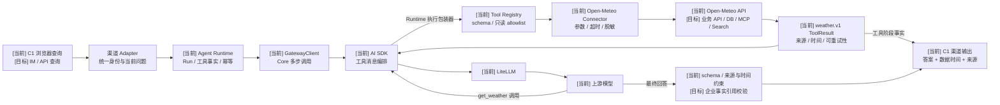

# 场景化输入到大模型交互链路

## 文档目的

本文件把“输入源到大模型”从一张全局总图拆成可单独建设、观测和验收的业务链路。后续新增能力时，先确定所属场景和链路节点，再完善实现、评测、监控与稳定契约，避免把所有输入都塞进同一条不可验证的通用流程。

所有业务模型请求仍必须经过 `Agent Runtime`。`GatewayClient -> AI SDK -> LiteLLM -> 上游模型` 是 Runtime 的统一下游模型调用段，不是与 Runtime 并列的业务入口。

链路节点使用以下状态：

| 标记 | 含义 |
| --- | --- |
| `[当前]` | V0.6 已有代码或稳定契约支持 |
| `[下一步]` | 从当前版本出发可优先落地的最小闭环 |
| `[目标]` | 目标架构能力，尚未实现，不能对外声明可用 |

## 四个质量维度

每条链路必须同时回答四个问题，不能只验证“模型有返回”：

| 维度 | 核心问题 | 主要证据 |
| --- | --- | --- |
| 准确度 | 输入有没有失真，模型依据是否正确，结果能否验证 | 场景 fixture、来源引用、结构化校验、任务成功率、纠正与反例回归 |
| 实时性 | 输入有多新，用户多久收到确认、首个有效结果和最终结果 | source freshness、排队耗时、各阶段耗时、首响应时间、端到端 P50/P95 |
| 稳定性 | 超时、重复、限流和局部故障时是否可恢复且不产生错误副作用 | 成功率、幂等重放、超时分类、重试与 fallback 记录、重复投递率、恢复演练 |
| Token 合理性 | 哪些信息进入上下文，是否挤占关键事实，投入是否产生有效结果 | 分段 token、Context Manifest、检索注入量、输出上限、压缩率、单次任务成本 |

准确度是最终结果指标，实时性、稳定性和 Token 是影响结果与体验的过程指标。所有指标都要按场景统计，不能只汇总成一个平台平均值。

## 共同底座与场景能力边界

共同底座是七条场景链路的必要条件，但不是充分条件。它负责复用执行骨架，不能替代图片处理、文档检索、业务工具、事件消费、写操作确认或批量任务等场景专属能力。

```text
输入治理 / 身份 / 校验 / 关联标识
  -> Agent Runtime / Run 状态 / 幂等
  -> 上下文装箱 / Token 预算
  -> GatewayClient / AI SDK / LiteLLM / 上游模型
       -> [按需] Runtime 工具 allowlist / 只读 Connector / ToolResult 回填
  -> 结果校验 / 错误分类 / 状态交付
  -> 准确度 / 实时性 / 稳定性 / Token 观测
```

| 能力类型 | 共同底座负责 | 场景链路仍需补齐 |
| --- | --- | --- |
| 输入 | 统一身份、基础校验、`requestId`、`conversationId` | 媒体、文档、业务数据、事件和批量输入的专属治理 |
| 执行 | Agent Runtime、Run 状态、幂等、模型调用边界、服务端工具 allowlist 和有界只读工具循环 | 各领域 Connector、检索、写操作确认、事件消费和异步任务 |
| 上下文 | Context Planner、结构化记忆、Token 预算，以及当前 Run 内 ToolResult 回填 | 跨 Run 引用证据、业务结果投影、事件富化结果和分片结果的装箱策略 |
| 输出 | 统一错误、结果状态、工具阶段事实和基础交付 | 逐图错误、文档引用、业务口径、执行回读和批量覆盖率 |
| 质量 | 统一 trace 字段和四维指标框架 | 每个场景独立的 fixture、基线、阈值和失败判定 |

因此，“输入被拼入 Prompt 且模型返回内容”不能作为一个场景完成的定义。只有场景专属节点和四维验收证据同时具备，才可以声明该场景达到基础可用。

## 引用与信息源语义

引用不是一组可以互换的字符串 ID。会话消息、图片、文档片段、网页快照、业务记录、工具结果、事件和操作回读分别具有不同的数据所有者、版本、时效、权限、完整性与重放语义；稳定契约必须按这些差异使用明确类型，不能把所有来源收敛为无类型的 `sourceIds`，也不能让渠道把引用正文直接拼入 Prompt。

跨场景采用“稳定引用容器 + 分类型成员”的方式：引用项通过 `type` 判别，类型自身定义必要标识和校验规则。容器保持稳定，类型只在对应场景进入主动建设并完成所有权、权限、版本、时效和失败语义后加入 OpenSpec；文档可以提前记录目标分类，但实现不得提前创建空字段、空表或占位 Resolver。

| 场景 | 引用类型方向 | 核心标识与语义 | 数据所有者 | 当前契约状态 |
| --- | --- | --- | --- | --- |
| C1 对话问答 | `conversation_message` | `messageId`；引用当前会话中已持久化的用户或助手消息 | Agent Runtime | 已进入稳定契约并实现 |
| C2 图片理解 | `image_asset` | 受控资产 ID、内容摘要、MIME 和版本；不能只依赖临时 URL | 媒体连接器 | 目标分类，未实现 |
| C3 文档知识问答 | `document_chunk`、`web_page_snapshot` | 文档/片段或网页快照 ID、版本、抓取时间和可打开来源 | 文档与知识连接器 | 目标分类，未实现 |
| C4 业务数据查询 | `business_record`、`tool_result` | 业务主键、查询口径、数据时间、工具调用 ID 和 schema 版本 | 业务连接器 | `tool_result` 已由天气只读工具进入稳定契约；企业业务记录仍未实现 |
| C5 实时事件处理 | `event_record` | 事件 ID、来源、发生时间、接收时间和去重语义 | 事件连接器 | 目标分类，未实现 |
| C6 操作执行 | `operation_preview`、`operation_result` | 操作 ID、确认版本、副作用状态和结果回读 | Agent Runtime 与业务连接器 | 目标分类，未实现 |
| C7 批量分析 | `batch_artifact` | 任务/分片 ID、数据截止时间、覆盖范围和产物版本 | 批任务与产物存储 | 目标分类，未实现 |

输入引用和回答证据使用相同的分类型思想，但不能混淆所有权：渠道提交的引用只表达用户选择了哪个既有对象，Runtime 或连接器负责按 ID 解析、鉴权和装箱；回答来源由执行链产生并携带版本、时间和验证状态。Trace 默认只记录引用 ID、类型和最小元数据，不复制敏感正文。

当前 C1 稳定契约只开放 `conversation_message`。实现后由渠道提交 `references: [{ type: "conversation_message", messageId }]`，Runtime 校验消息属于当前会话且可访问，从事实源读取内容并持久化引用关系；不得信任浏览器重复提交的消息正文，也不得递归展开被引用消息中的其他引用。其他类型等对应场景真正建设时再增加，避免提前造空结构。

## 共同底座的重试与恢复边界

重试是共同底座的横切稳定性能力，七条场景链路都应复用统一的幂等、总时间预算、错误分类、退避和观测语义。但是，“整条链路具备重试能力”不等于任何失败都从浏览器输入开始完整重跑；每个阶段必须从最近一个已提交的稳定状态恢复，避免重复写消息、重复调用模型或重复产生外部副作用。

当前已具备 `requestId` 幂等重放、同进程同会话串行、SQLite 事件游标、Memory Manager 乐观锁重试、Token Counter 本地估算回退，以及由平台统一重试执行器控制的模型重试。AI SDK 内建自动重试仍保持关闭，避免与 Runtime 或 LiteLLM 的策略叠乘；当前实现覆盖 C1 模型调用，其他场景阶段仍按下表逐步接入。

### 统一韧性上下文

一次 Run 应共享一个 `ResilienceContext`，由 Runtime 持有并向各阶段传递最小恢复信息：

| 字段 | 语义 |
| --- | --- |
| `traceId`、`requestId`、`conversationId`、`runId` | 关联同一次业务请求、幂等重放和全部阶段尝试 |
| `deadlineAt` | 整个 Run 的绝对截止时间；所有阶段和重试共享，不能逐层重新获得完整超时 |
| `stage`、`lastCommittedStage` | 当前执行位置和最近已提交的稳定状态，用于局部恢复而不是整链重跑 |
| `outputStarted` | 是否已经向用户交付有效输出；开始输出后不得静默重新生成并拼接回答 |
| `idempotencyKey` | 当前操作的幂等键；写操作没有业务幂等和结果回读时不得自动重试 |

每类操作通过 `RetryPolicy` 表达 `operation`、`maxAttempts`、`retryableErrors` 和 `backoff`；执行器为单次尝试提供 `attempt` 和 `maxAttempts`，并与 `ResilienceContext` 中的截止时间、幂等键和输出状态共同完成判定。统一的是字段、判定顺序、总预算和 trace，不是让所有阶段使用相同的重试次数。

### 分阶段恢复策略

| 阶段 | 当前能力 | 恢复或重试边界 |
| --- | --- | --- |
| 浏览器到 Adapter | `[当前]` 浏览器为每次提交生成 `requestId` 和 `clientMessageId` | 网络结果不确定时使用原标识查询或重发，不创建第二条用户消息 |
| Run 与消息落库 | `[当前]` 事务、唯一约束和 SQLite `busy_timeout` | 只对锁冲突等明确瞬时存储错误做短重试；已提交后返回既有状态 |
| Context Planner | `[当前]` 从 SQLite 事实源读取快照 | 状态冲突时重读快照并重新规划，不重写已提交消息 |
| Token Counter | `[当前]` LiteLLM 计数失败后使用本地估算 | 属于可降级优化，不持续重试并阻断主回答 |
| Memory Manager | `[当前]` `memoryVersion` 冲突后重读并重算，最多尝试三次 | 只重算尚未压缩的连续区间，不回滚原始消息或主 Run |
| 模型生成 | `[当前]` AI SDK `maxRetries: 0`，平台统一重试执行器拥有唯一尝试预算并将证据写入 Run | 默认 `maxAttempts: 3`，即首次调用加两次重试；只处理瞬时网络错误、408、429、500、502、503、504，并遵守 `Retry-After` |
| 流式交付 | `[当前]` `POST .../runs/stream` 通过 SSE 交付 AI SDK 文本增量；独立事件流按 SQLite 游标同步已落库事实 | 首个有效文本增量前可重试模型；开始输出后不静默重生成。浏览器断线后查询 Run 最终状态，不要求 Token 级断点续传 |
| 当前只读 Connector | `[当前]` Open-Meteo 查询共享 Run 截止时间和取消信号；失败保存安全 ToolResult 并回填模型 | 当前不自动重试 Connector；已完成 Run 的幂等重放直接返回工具事实，不再次访问外部服务 |
| 未来写操作 | `[目标]` 尚未实现 | 必须具备业务幂等键、结果回读和不确定状态处理；未知结果不得自动重放 |

### C1 当前模型重试策略

```text
maxAttempts: 3
maxRetries: 2
totalDeadline: 120s
backoff: exponential + jitter
retryBoundary: before-first-valid-output
durability: one Run + one final assistant message
```

总时间预算覆盖接入、排队、上下文规划、所有模型尝试、持久化和结果交付，不能把 120 秒分别分配给每次模型尝试。Runtime、AI SDK 和 LiteLLM 只能有一层拥有主要尝试预算，防止多层重试次数相乘。模型文本增量只在内存和网络层传递，最终回答完成后一次性事务落库；C1 不逐 Token 写 SQLite，也不保存回答 checkpoint，断线时恢复 Run 最终状态而不是续传缺失 Token。

## 场景清单

| 链路 | 输入源 | 期望输出 | 当前状态 | 首个建设目标 |
| --- | --- | --- | --- | --- |
| C1 对话问答 | Web 文本；未来 IM、IDE、API 文本 | 连续、可纠正的自然语言回答 | V0.6 Demo 已跑通；ChainTrace 技术接入默认关闭，真实 Runtime 验收为 TODO | 保持功能回归；按触发条件恢复运行态验收 |
| C2 图片理解 | 图片 URL、图片 data URL | 图片分析、问答或结构化识别结果 | 已透传到视觉模型，缺少媒体治理 | 补媒体校验、能力路由和视觉评测 |
| C3 文档知识问答 | 文档链接、文件、知识库 | 带引用和时效说明的回答 | 当前只把 URL 当文本，不读取文档 | 跑通单一文档源的解析、检索、引用 |
| C4 业务数据查询 | 业务 API、数据库、MCP、搜索 | 基于实时业务事实的可验证回答 | 已通过 C1 渠道跑通 Open-Meteo 只读天气的确定性工具闭环；企业业务数据仍未实现 | 补真实模型天气验收、追问复用证据和更多业务 Connector 的选型 |
| C5 实时事件处理 | Webhook、IM 事件、消息队列、告警 | 分类、摘要、建议或及时通知 | 未实现；当前 SSE 仅用于模型文本交付和会话事实同步 | 跑通单一事件源的去重、富化和通知 |
| C6 操作执行 | 用户指令、审批动作、Agent 计划 | 可确认、可审计、可验证的业务操作 | 已有只读工具循环，但写操作、人工确认和结果回读未实现 | 先补权限、预览、业务幂等和人工确认，再增加一项低风险写操作 |
| C7 批量分析 | 多文件、表格、历史记录、离线任务 | 完整报告、清单或结构化结果集 | 未实现 | 建立可分片、可恢复、可控预算的异步任务 |

## 当前建设焦点：C1 功能可用与确定性回归

当前优先保持 C1 对话链路的功能可用、确定性回归和能力理解。ChainTrace 代码与后端资产继续保留，但正式实例和真实 Runtime Trace 验收按触发条件恢复，不再作为当前功能迭代或其他低风险场景调研的硬门禁。

这不代表 C2-C7 已经可用，也不允许跳过各场景自身的数据所有权、权限、输入治理、错误语义和回归测试。进入多人共享、准生产、跨节点运行，或出现无法通过 Run 状态和日志定位的问题时，再恢复完整 ChainTrace 与四维运行态验收。

### 当前基础与缺口

| 范围 | 当前已有基础 | C1 仍需补齐 |
| --- | --- | --- |
| 会话与 Run | SQLite 会话事实源；`requestId`、`clientMessageId` 幂等；同进程同会话串行；标题与独立归档事实；恢复 Run 来源关系 | 把跨进程并发与更多异常恢复结果纳入链路证据 |
| 上下文与记忆 | 结构化记忆、Context Planner、Context Manifest、token 高低水位 | 用真实模型验证纠正、实体隔离、任务状态和来源追溯 |
| 模型调用 | `GatewayClient -> AI SDK -> LiteLLM -> 上游模型` 已跑通；Run 可选择网关可见模型别名并保存实际模型与 usage | 固定评测模型、Prompt、fixture 和参数，建立可重复比较的四维基线 |
| 只读工具 | C1 渠道可按模型决策调用服务端 `get_weather`；Runtime 校验 allowlist、持久化 ToolResult，并通过 SSE 交付真实工具阶段 | 补真实模型天气验收和追问证据；该切片只证明天气工具闭环，不代表完整 C4 业务数据能力 |
| 结果交付 | JSON Run、POST SSE 模型文本流、助手消息最终单次落库和 SSE 多端同步；渠道支持安全 Markdown、长列表窗口、键盘与移动端基线 | 当前以功能回归和 gzip 预算为主；正式阶段耗时基线按 TODO 触发条件恢复 |
| 重试与恢复 | 幂等、模型重试、SSE 重连、记忆版本冲突、Token Counter 回退和逐尝试证据已进入 Run 或 Trace；渠道可创建 `retry / regenerate / continue` 新 Run | 当前保持自动化回归；真实模型超时、网关错误和更复杂断连样本延期 |
| 可观测 | 已有后端中立 `ChainTracer`、OTLP/HTTP protobuf、Phoenix 选型、部署入口、PoC 业务 ID 查询和敏感正文脱敏 | TODO：正式实例真实 JSON/SSE Run、三业务 ID 查询、隐私复核、故障隔离和四维基线 |

### C1 完整运行态验收定义（TODO）

下表保留为进入多人共享、准生产或生产阶段前的完整验收定义，当前不要求全部执行，也不用于阻断日常功能迭代。

| 维度 | 完成标准 | 验收证据 |
| --- | --- | --- |
| 功能闭环 | 浏览器纯文本输入可以稳定完成多轮对话、纠正、显式取消、恢复、幂等重放和会话关闭 | API 回归、浏览器链路验证、会话与 Run 状态记录 |
| 准确度 | 固定真实模型 fixture 能验证最新纠正、旧事实不泄漏、实体隔离、任务状态和来源有效性 | 通过数/总数、准确率或泄漏率、失败案例；样本不足 30 时只报告观察结果 |
| 实时性 | 接入、排队、Context Planner、模型、持久化和交付耗时可区分 | 单阶段耗时、端到端 P50/P95、实际模型和测试时间 |
| 稳定性 | 输入错误、重复请求、同会话并发、用户取消、模型超时、网关错误、空响应和 SSE 断连都有确定状态；模型在首次有效输出前按统一预算自动重试 | 自动化测试、错误分类、逐尝试 trace、幂等重放和恢复记录 |
| Token 合理性 | 能解释系统规则、当前输入、记忆、Episode、历史和输出分别占用多少，以及哪些候选被排除 | 分段 token、provider usage、Context Manifest、压缩前后对比 |
| 可追踪性 | 一次请求可用 `requestId + conversationId + runId` 关联输入、上下文选择、模型调用、结果和错误 | 完整 C1 `ChainTrace`，敏感正文默认不进入 trace |
| 回归能力 | 确定性 Runtime 回归与真实模型评测分开执行和报告 | fixture 版本、模型别名、实际模型、Prompt 版本、参数、token、费用和延迟 |

### 实施顺序与退出条件

```text
确认 C1 当前行为与 fixture
  -> [已完成] 接入默认关闭的 C1 ChainTrace 代码与契约
  -> [已完成] 完成后端对比、Phoenix 选型和部署入口
  -> [已完成] 跑通确定性 Runtime 回归
  -> [当前] 保持 C1 功能可用、回归稳定和能力理解
  -> [按业务价值] 调研或实现其他低风险场景最小闭环
  -> [TODO 触发后] 启动正式实例并完成真实 Runtime Trace
  -> [TODO 触发后] 建立四维运行态基线、异常样本和告警阈值
```

C1 当前功能可用以浏览器/API 主链和自动化回归为证据；不宣称已经完成正式可观测或生产验收。TODO 恢复后的运行态退出条件仍是：一组正式实例可检索 Trace、一份固定版本真实模型四维基线、一组异常与并发验证，以及每个已知边界的明确状态。若实现过程中改变 Session/Run API、上下文预算、模型路由、多模态输入或鉴权，再同步 OpenSpec。

## C1 对话问答链路

### 适用范围

适用于用户围绕同一会话持续提问、纠正事实、补充约束和追问结果。浏览器 Demo 是当前真实入口；未来 Web、IM、IDE 和 API Adapter 复用同一个 Run 契约。

```mermaid
flowchart LR
  Source["[当前] 浏览器文本 / 模型选择<br/>[目标] IM / IDE / API 文本"]
  Adapter["渠道 Adapter<br/>身份映射 / requestId / conversationId / model<br/>可选 sourceRunId / recoveryMode"]
  Normalize["[当前] 输入与模型别名归一化校验"]
  Runtime["[当前] Agent Runtime<br/>幂等 Run / 同会话串行"]
  StoreIn["[当前] SQLite 先写用户消息"]
  Planner["[当前] Context Planner<br/>记忆 / Episode / 最近消息"]
  Gateway["[当前] GatewayClient<br/>平台统一重试 / Core 多步调用"]
  AiSdk["[当前] AI SDK<br/>文本生成 / 工具消息编排"]
  LiteLLM["[当前] LiteLLM"]
  Model["[当前] 上游模型"]
  Registry["[当前] Runtime Tool Registry<br/>只读 allowlist / schema"]
  Weather["[当前] get_weather / Open-Meteo<br/>固定 HTTPS 端点"]
  ToolResult["[当前] ToolResult 事实<br/>状态 / 来源 / 数据时间"]
  StoreOut["[当前] 写回答 / usage / Context Manifest"]
  Delivery["[当前] POST SSE 文本流 / 事实同步<br/>分类失败原因 / 恢复入口"]
  Memory["[当前] Memory Manager 异步压缩"]

  Source --> Adapter --> Normalize --> Runtime --> StoreIn --> Planner
  Planner --> Gateway --> AiSdk --> LiteLLM --> Model
  Model -->|工具调用| AiSdk
  AiSdk -->|Runtime 执行包装器| Registry --> Weather --> ToolResult --> AiSdk
  ToolResult -->|tool-started / completed / failed| Delivery
  Model -->|文本增量| Delivery
  Model -->|最终结果| StoreOut -->|completed / 事实同步| Delivery
  StoreOut -.-> Memory
  Memory -.-> Planner
```



| 质量维度 | 本链路控制点 |
| --- | --- |
| 准确度 | 验证最新纠正优先、实体隔离、未完成任务和来源追溯；增加真实模型固定 fixture，而不只检查响应非空 |
| 实时性 | 分开记录 Adapter、排队、Context Planner、首文本增量、模型完成、持久化和最终交付耗时 |
| 稳定性 | 保留 `requestId` 和 `clientMessageId` 幂等；区分输入错误、Run 冲突、鉴权、限流、模型超时、上游故障和空响应，并向渠道返回安全处理建议 |
| Token 合理性 | 记录系统规则、当前输入、结构化记忆、Episode、历史消息和输出的分段 token；检查被排除内容是否符合优先级 |

友好交互要求：收到输入后明确当前状态；用户可选择网关授权的模型别名；本地会话加载不依赖网关探测完成；工具阶段只能由服务端事实驱动，并在实时天气回答中说明地点、数据时间和来源；生成失败时在对应输入后说明安全原因和处理建议，并允许用新 Run 重试、编辑后发送、重新生成或继续生成；长回答可导航和消费；问题缺少关键条件时先澄清；回答中区分已知事实、推断和不确定项；用户纠正后能在后续轮次稳定使用新事实。

## C2 图片理解链路

### 适用范围

适用于截图分析、视觉问答、图片信息提取和图文混合输入。当前 Runtime 支持图片 URL 与图片 data URL，并由 AI SDK 原样交给 LiteLLM；当前没有文件大小、真实 MIME、可访问性、恶意内容或模型视觉能力的完整治理。

```mermaid
flowchart LR
  Source["[当前] 图片 URL / data URL<br/>[目标] 受控文件上传"]
  Adapter["渠道 Adapter<br/>文本问题 + 图片引用"]
  MediaGuard["[下一步] 媒体校验<br/>MIME / 大小 / 数量 / 可访问性"]
  Runtime["[当前] Agent Runtime<br/>持久化显示文本与原始内容"]
  Planner["[当前] Context Planner<br/>会话事实与图片问题"]
  Capability["[下一步] 模型能力路由<br/>视觉支持 / 限额 / fallback"]
  Gateway["[当前] GatewayClient"]
  AiSdk["[当前] AI SDK<br/>URL 原样转发"]
  LiteLLM["[当前] LiteLLM"]
  Model["[当前] 上游视觉模型"]
  Validator["[下一步] 结果校验<br/>结构化字段 / 空结果 / 截断"]
  Delivery["渠道输出<br/>逐图错误 / 结果 / 不确定项"]

  Source --> Adapter --> MediaGuard --> Runtime --> Planner --> Capability
  Capability --> Gateway --> AiSdk --> LiteLLM --> Model --> Validator --> Delivery
```



| 质量维度 | 本链路控制点 |
| --- | --- |
| 准确度 | 建立截图、表格、文档照片和多图关联 fixture；分别验证文字识别、对象理解、定位和结构化字段 |
| 实时性 | 分开统计上传或取图、媒体检查、视觉推理和结果组装耗时，避免把网络取图延迟误判为模型延迟 |
| 稳定性 | 单张图片不可访问时返回明确的逐图错误；限制图片数量和大小；模型不支持视觉时不得静默降级为纯文本 |
| Token 合理性 | 同时记录文本 token 与 provider 返回的视觉计费单位；多图先筛选、缩放或分批，不把所有原图无条件送入模型 |

友好交互要求：展示已接收的图片数量和失败项；用户未给问题时使用明确的默认分析目标；结构化识别结果允许用户纠正单个字段，而不是重新提交全部图片。

## C3 文档知识问答链路

### 适用范围

适用于公开文档、私有文件、企业知识库和跨文档问答。当前 `documentUrls` 只作为文本链接附在用户消息中，Runtime、LiteLLM 和模型都不会自动读取链接内容；因此当前不能宣称已经具备文档问答或 RAG。

```mermaid
flowchart LR
  Source["[目标] 文档链接 / 文件 / 知识库"]
  Adapter["渠道 Adapter<br/>身份 / 文档引用 / 当前问题"]
  Runtime["Agent Runtime<br/>Run / 权限上下文 / 任务状态"]
  Ingest["[目标] Knowledge Connector<br/>鉴权 / 下载 / 解析 / 去噪"]
  Index["[目标] 分块 / 索引 / 版本 / 有效时间"]
  Retrieve["[目标] 权限过滤 / 检索 / 重排"]
  Pack["[目标] Context Planner<br/>问题 + 证据片段 + 引用预算"]
  Gateway["GatewayClient"]
  AiSdk["AI SDK"]
  LiteLLM["LiteLLM"]
  Model["上游模型"]
  Evidence["[目标] 答案校验<br/>引用 / 版本 / 时效 / 不确定项"]
  Delivery["渠道输出<br/>答案 + 可打开引用"]

  Source --> Adapter --> Runtime --> Ingest --> Index --> Retrieve --> Pack
  Pack --> Gateway --> AiSdk --> LiteLLM --> Model --> Evidence --> Delivery
```



| 质量维度 | 本链路控制点 |
| --- | --- |
| 准确度 | 分开评估解析完整率、检索召回、重排精度、引用覆盖和最终答案；无证据时明确拒答或说明缺口 |
| 实时性 | 记录文档版本时间、索引完成时间和检索时刻；交互请求不能同步等待大文档全量重建 |
| 稳定性 | 下载、解析、索引、检索分别可重试并保留状态；权限失败、格式不支持和内容损坏必须可区分 |
| Token 合理性 | 先检索再注入，按文档、片段和去重结果分配预算；记录候选 token、入选 token、引用 token 和输出 token |

友好交互要求：告诉用户实际读取了哪些文档版本；答案中的关键结论能跳回原文；资料过期、冲突或不足时直接说明，而不是拼成确定性答案。

## C4 业务数据查询链路

### 适用范围

适用于查询项目、需求、订单、监控、代码仓库或其他实时业务数据。当前以 Open-Meteo 天气查询作为第一个真实只读工具，验证选择、参数校验、allowlist、执行、结果回填和失败处理；企业业务数据连接器仍未实现。



| 质量维度 | 本链路控制点 |
| --- | --- |
| 准确度 | 工具参数和返回 schema 必须确定性校验；回答中的业务数字能追溯到 ToolResult 字段和查询条件 |
| 实时性 | 返回数据携带 `observedAt` 或业务版本；分别记录工具查询和模型解释耗时，允许无需模型的确定性结果直接返回 |
| 稳定性 | 只对明确可重试的只读调用重试；工具超时、权限不足、空数据和上游错误使用不同状态；同一 Run 不重复产生调用风暴 |
| Token 合理性 | 大结果先投影、筛选、聚合和分页，再送入模型；记录原始结果规模、压缩后规模和模型实际使用量 |

友好交互要求：查询条件含糊时先确认范围；回答显示数据时间和筛选口径；没有数据与查询失败要使用不同提示；用户可基于同一结果继续追问而不重复拉取全部数据。

## C5 实时事件处理链路

### 适用范围

适用于告警、Webhook、IM 事件和消息队列事件的分类、摘要、建议或通知。当前 SSE 只同步 Runtime 已落库事件，不等于已经支持外部实时事件接入。


| 质量维度 | 本链路控制点 |
| --- | --- |
| 准确度 | 用带严重级别和期望动作的事件 fixture 验证分类、摘要、漏报和误报；模型输出还要经过确定性通知规则 |
| 实时性 | 记录事件发生、平台接收、入队、开始处理和送达时间；source freshness 与端到端延迟必须同时可见 |
| 稳定性 | `eventId` 去重、合并窗口、背压和死信缺一不可；投递结果区分成功、失败和不确定，避免不确定状态自动重复通知 |
| Token 合理性 | 高频相似事件先规则聚合再调用模型；使用时间窗、采样和摘要限制事件风暴带来的 Token 放大 |

友好交互要求：通知说明发生了什么、何时发生、影响对象和建议动作；相同事件避免重复打扰；延迟事件必须显示事件原始时间，不能伪装成刚刚发生。

## C6 操作执行链路

### 适用范围

适用于创建、修改、发送、发布等会改变外部状态的请求。模型只生成计划和结构化参数，不能直接绕过 Runtime、权限校验和人工确认调用写接口。

```mermaid
flowchart LR
  Source["[目标] 用户操作指令"]
  Adapter["渠道 Adapter<br/>身份 / 请求上下文"]
  Runtime["[目标] Agent Runtime<br/>意图 / 风险 / 任务状态"]
  Read["[目标] 只读 Connector<br/>读取当前状态与前置条件"]
  Plan["[目标] 模型生成操作计划与参数"]
  Validate["[目标] Tool schema / 权限 / 策略校验"]
  Preview["[目标] 变更预览<br/>影响范围 / 风险 / 幂等键"]
  Confirm["[目标] 人工确认凭证"]
  Execute["[目标] 写 Connector<br/>执行 / 超时 / 幂等"]
  Verify["[目标] 回读验证 / 审计事件"]
  Delivery["渠道输出<br/>实际结果 / 部分失败 / 后续动作"]

  Source --> Adapter --> Runtime --> Read --> Plan --> Validate --> Preview --> Confirm --> Execute --> Verify --> Delivery
```



模型调用段由 Runtime 内部统一使用 `GatewayClient -> AI SDK -> LiteLLM -> 上游模型`，图中将其收敛为“模型生成操作计划”，以突出写操作的确认和验证边界。

| 质量维度 | 本链路控制点 |
| --- | --- |
| 准确度 | 参数 schema、业务前置条件和执行后回读必须确定性验证；模型生成的解释不能替代真实执行结果 |
| 实时性 | 长任务及时返回已受理和进度；确认前重新检查关键数据的新鲜度，防止用户确认过期预览 |
| 稳定性 | 写操作使用业务幂等键，不对未知结果自动重试；支持部分成功、补偿或人工接管，并完整记录审计轨迹 |
| Token 合理性 | 只向模型提供决策所需字段；执行日志和大对象保存在系统中，以引用或摘要进入上下文 |

友好交互要求：执行前展示具体变更和影响对象；确认与执行结果分开；失败时说明哪些已完成、哪些未执行、能否重试或撤销。

## C7 批量分析链路

### 适用范围

适用于多文件、多表格、大量历史记录或周期性离线分析。该场景不能复用同步对话接口硬塞全部输入，需要独立任务、分片、检查点和预算。


| 质量维度 | 本链路控制点 |
| --- | --- |
| 准确度 | 记录总输入、成功分片、失败分片和结果覆盖率；抽样复核与全量 schema 校验分开，避免只看最终报告 |
| 实时性 | 明确数据截止时间和任务完成时间；展示进度、预计剩余量和最后 checkpoint，不把异步任务伪装成实时回答 |
| 稳定性 | 分片可独立重跑，聚合幂等，任务可暂停和恢复；单个坏文件不能让整个批次丢失已有结果 |
| Token 合理性 | 任务创建时估算总预算；按分片设置输入输出上限；聚合阶段使用层级摘要，记录每个分片和总任务 Token |

友好交互要求：开始前明确处理范围和预计资源；过程中可查看进度与失败项；完成后同时提供结果、覆盖率、数据截止时间和未处理清单。

## 统一交互状态

不同渠道可以使用不同文案和 UI，但 Runtime 或任务层应能表达统一状态：

| 状态 | 含义 | 用户侧必须看到的内容 |
| --- | --- | --- |
| `accepted` | 输入已校验并创建 Run 或任务 | 已受理、请求标识、后续状态入口 |
| `clarification_required` | 缺少影响结果的关键条件 | 缺什么、可选范围、原请求不会被执行 |
| `processing` | 正在查询、检索、推理或执行 | 当前阶段；长任务提供进度或最近更新时间 |
| `confirmation_required` | 写操作等待人工确认 | 变更预览、风险、影响对象、确认有效期 |
| `completed` | 已完成且结果已验证 | 结果、来源与时间、Token/trace 内部证据、可继续动作 |
| `cancelled` | 用户显式停止仍在执行的 Run | 已停止、已保留的部分内容、该内容是否会进入后续上下文 |
| `partial` | 部分数据或步骤成功 | 成功范围、失败范围、是否可继续或重试 |
| `failed` | 未产生可信结果 | 失败阶段、可否重试、是否可能存在外部副作用 |

当前 V0.6 已同时提供 JSON Run 和 C1 POST SSE 文本流，但尚未把上表全部状态固化为跨场景 API；该表仍是后续多场景需要收敛的目标状态模型。

## 统一观测结构

后续链路治理建议先定义内部 `ChainTrace`，再决定是否拆出治理服务。它不是把所有业务数据复制到日志，而是记录定位四个质量维度所需的最小证据。

| 字段组 | 最小字段 |
| --- | --- |
| 身份与关联 | `traceId`、`requestId`、`scenarioId`、`tenantId`、`appId`、`userId`、`conversationId`、`runId` |
| 输入证据 | 输入类型、来源引用、来源版本或 `observedAt`、附件数量、原始规模；敏感正文不默认写入 trace |
| 执行版本 | `agentId`、`agentVersion`、工具版本、检索策略版本、模型策略和实际模型 |
| 阶段耗时 | 接入、排队、归一化、检索或工具、Context Planner、模型、校验、持久化、投递 |
| Token 与费用 | 固定规则、当前输入、记忆、历史、检索或工具结果、输出的 token，以及 provider usage 和费用 |
| 结果状态 | 成功、部分成功、失败阶段、错误分类、`attempt`、`maxAttempts`、退避、重试判定、fallback、幂等重放、`outputStarted`、外部副作用状态 |
| 准确度证据 | fixture 或反馈标签、引用列表、schema 校验结果、事实冲突、人工纠正和任务结果 |

当前 C1 已在代码中为 Context Manifest、Run usage、接入、排队、规划、模型、持久化和交付阶段接入 ChainTrace，并通过 PoC 验证 Phoenix 可按三个稳定业务 ID 检索；正式实例上的真实 Runtime JSON/SSE Trace 尚未验收。表中的租户、应用、工具、检索、费用和外部副作用字段仍是跨场景目标，不得因技术接入存在而宣称 C1 已完成运行态闭环或 C2-C7 具备同等观测能力。

## 单条链路的建设与验收模板

每次只选一条链路的一个最小闭环，按以下顺序推进：

1. **界定输入与输出**：固定输入源、身份、数据新鲜度、允许的输出和禁止的副作用。
2. **建立 fixture**：至少覆盖正常、含糊、过期、冲突、超大输入、超时、重复和权限不足。
3. **补最小实现**：只实现这条链路需要的 Adapter、Runtime、Connector、Gateway 或校验节点。
4. **按阶段补观测**：初期至少保留 Run 状态、错误和回归证据；触发运行态验收后，再为每个阶段记录耗时、Token、来源版本和错误分类。
5. **建立基线**：进入多人共享、准生产或实际稳定性治理前，固定模型与策略，运行离线评测和故障测试，记录四维基线，不先拍脑袋设平台统一阈值。
6. **设置门禁**：根据风险设置场景阈值；关键结构化字段、权限和写操作校验必须是确定性硬门禁。
7. **固化契约**：行为、API、鉴权、模型路由、上下文预算或多模态契约变化时同步 OpenSpec，再进入下一条链路。

功能迭代阶段每条链路至少交付一组 fixture、相关自动化测试和明确的已知边界；进入运行态验收后，再补一张可检索链路图、一份基线报告和一组阶段 Trace。

## 建议完善顺序

| 顺序 | 链路 | 原因 | 完成标志 |
| --- | --- | --- | --- |
| 1 | C1 对话问答 | 当前已经可运行，先保持功能回归和能力理解 | 主链回归稳定；触发运行态验收后再补阶段耗时和分段 Token 基线 |
| 2 | C2 图片理解 | 已有传输通道，可用较小改动补齐输入治理 | 媒体校验、视觉能力路由、逐图错误和视觉 fixture 稳定 |
| 3 | C4 业务数据查询 | 符合 V0.6 到 V1 的“第一个真实只读工具”里程碑 | 一个只读业务源完成权限、schema、超时、来源和追问闭环 |
| 4 | C6 操作执行 | 必须建立在只读工具、幂等和审计稳定之后 | 一个低风险写操作具备预览、确认、执行和回读验证 |
| 5 | C3 文档知识问答 | 需要独立解析、索引、权限和引用能力 | 单一文档源从解析到带引用回答可回归 |
| 6 | C5 实时事件处理 | 需要队列、去重、背压和投递状态治理 | 单一事件源能在事件风暴下稳定合并、处理和通知 |
| 7 | C7 批量分析 | 依赖前面形成的连接器、观测和预算能力 | 大输入任务可分片、暂停、恢复，并给出覆盖率和总预算 |

优先顺序可以因真实业务价值调整，但不应跳过前置边界。例如，没有只读工具的参数、权限和结果治理时，不直接建设写操作；没有文档版本和权限时，不直接把向量检索结果当成可信知识。
